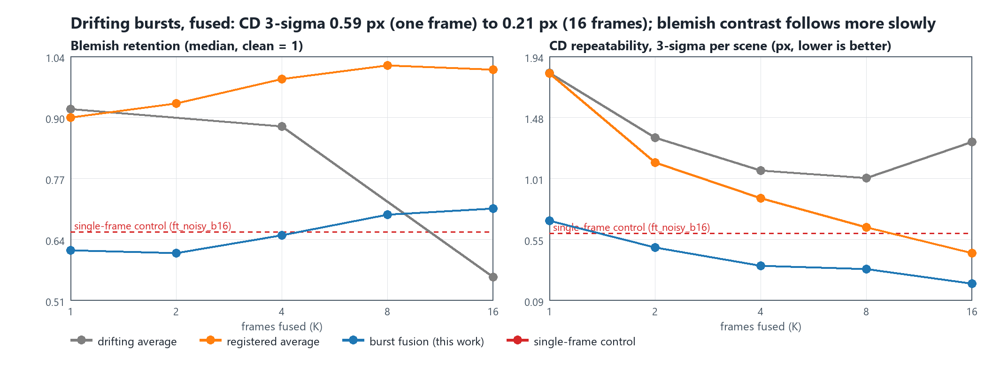
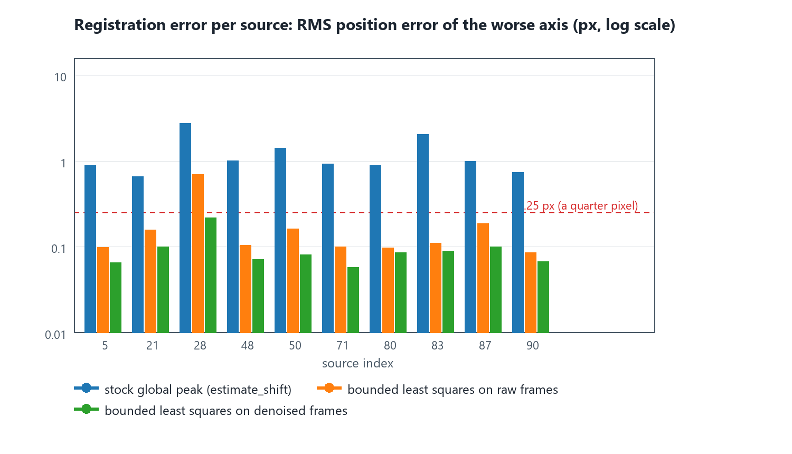
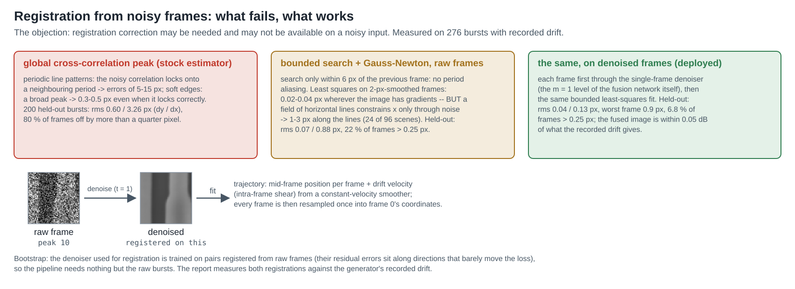
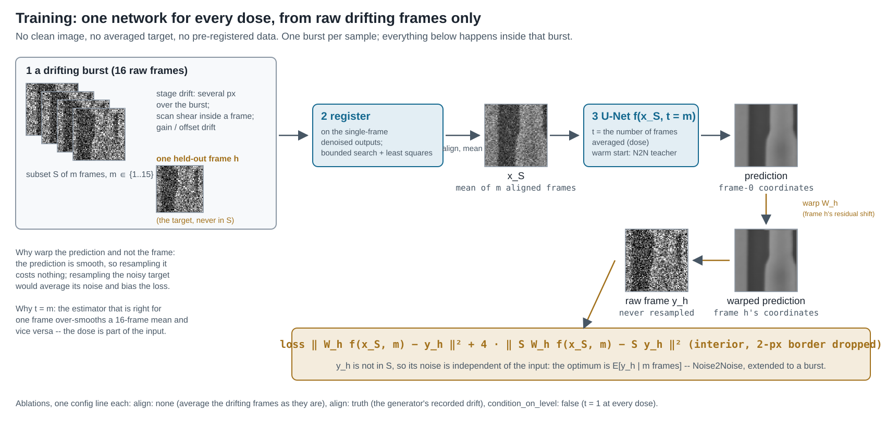
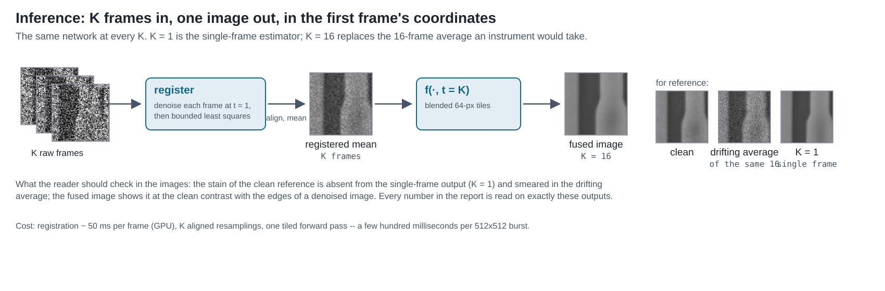
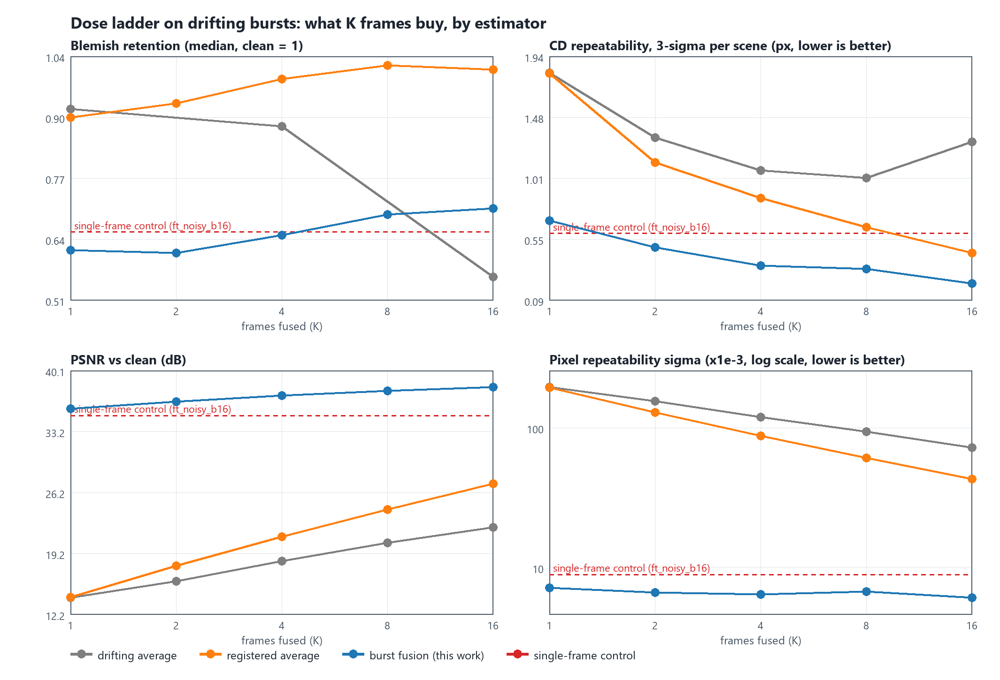
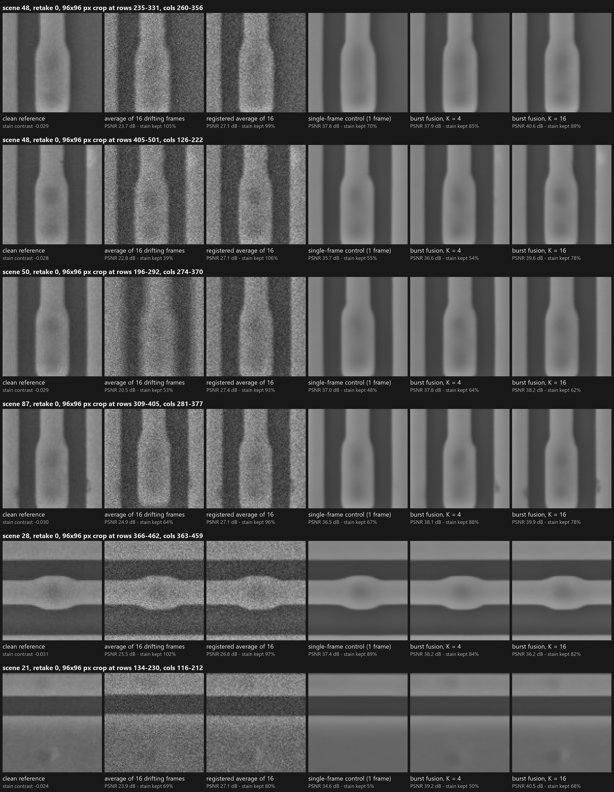
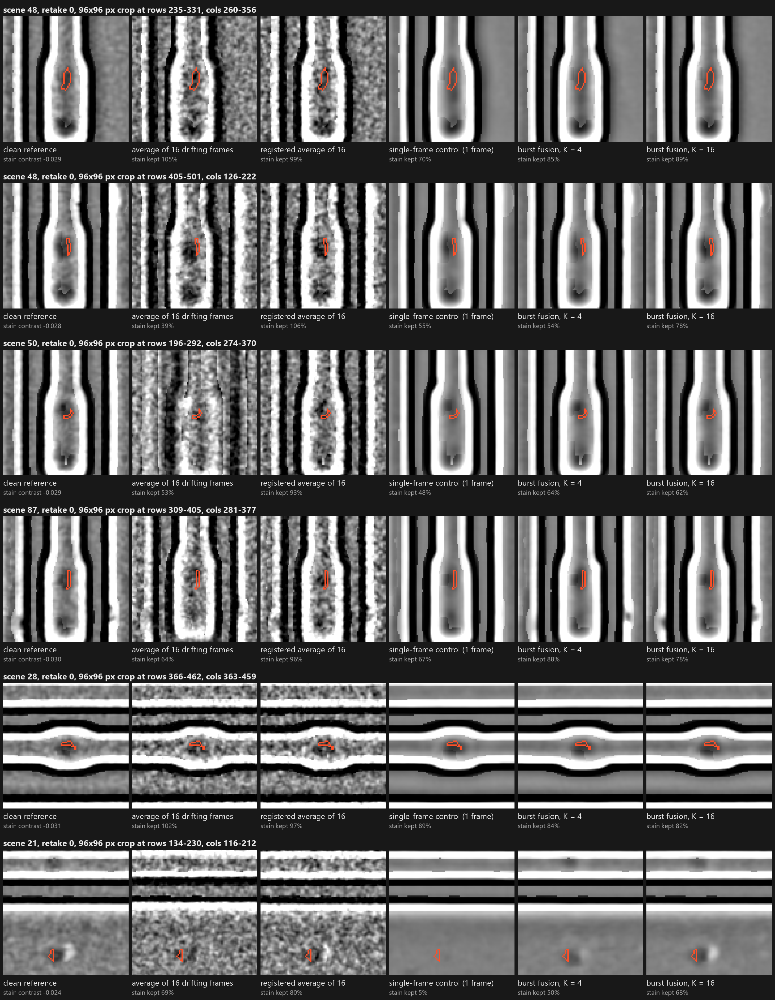

# Burst Fusion Under Drift — Fine Features From the Burst, Not From a Prior

> **Conclusion.** The fine features a 16-frame average shows are not
> recoverable from one frame at this dose by any estimator — so the pipeline
> now uses the other frames, and it does so on *drifting* bursts, with
> nothing but the raw frames at training time. Registration from noisy
> frames, the objection to any burst-based method, is solved and measured:
> the stock correlation peak fails by 5–15 px on these periodic patterns, a
> bounded least-squares fit on the single-frame denoiser's outputs registers
> 200 held-out drifting bursts to 0.04 / 0.13 px rms, and the fused image is
> within 0.05 dB of what the recorded drift would give. The fusion network —
> one U-Net conditioned on the number of frames, trained on registered
> subsets against raw frames read in their own coordinates — turns the burst
> into metrology: **CD 3σ per scene 0.594 px (best single-frame arm) →
> 0.349 px with four drifting frames → 0.214 px with sixteen**, on 10/10
> scenes (p = .008), with |bias| halved and 2.4× tighter feature centres,
> against 1.29 px and a 25 % failure rate for the drifting average an
> instrument would otherwise use. The clear stains come back to 78–89 % of
> their contrast (single-frame arms 48–70 %), the faintest from 5 % to 68 %,
> on a denoised background; over all 112 dev-scene features the median
> rises from 0.66 to 0.71 and the share shown above half contrast from 71 %
> to 92 %. **A clean-target oracle trained the same way lands at 0.70 and
> CD 3σ 0.211 px**: the self-supervised network is at this estimator's
> ceiling. What remains — most of the 112 features have a 16-frame SNR near
> 2, and a conditional mean shows such a feature at its posterior
> probability — is a matter of dose or of a decision estimator, not of
> training (§5.3).



*2026-09-05 · code: [`edge_denoise/`](../) (`drift.py`, `register.py`, `fusion.py`) ·
precedes: [`fine_feature_report.md`](fine_feature_report.md) · results:
`runs/edge_denoise/repeatability_val_fusion*/`, `runs/edge_denoise/fine_features_fusion*/`,
`runs/edge_denoise/registration_drift_*.accuracy.json`*

**The two objections this report answers.** The previous study left two
things unresolved. First, no single-frame arm — not the fine-tunes, not the
clean-target oracle, not the diffusion sampler — reproduces the stains and
blemishes that a plain 16-frame average shows at once. Second, the arms that
scored best trained on *averaged noisy frames*, which is admissible only on
pixel-aligned bursts; real SEM bursts drift, and a registration step on noisy
frames was assumed unavailable. This report treats both as the problem
statement: **make the acquisition drift, take nothing but the raw frames, and
recover the features the average shows — without the average's noise, with
better edge metrology than the average, and without a clean image or a
pre-registered dataset anywhere in training.**

**TL;DR**

- **The acquisition drifts now.** `generate-drift` renders bursts with stage
  drift (median 3.7 px per axis over 16 frames, 90th percentile 8.8), scan
  shear inside each frame, charging gain/offset drift and the same clipped
  Poisson noise; the truth is recorded and used only to grade registration.
  Ten retakes per dev scene give every burst method the retake count the
  single-frame arms always had (§2).
- **Registration from noisy frames works, once done right (§3).** Global
  correlation peak: 5–15 px errors (periodic lines). Bounded search plus
  Gauss-Newton on raw frames: 0.02–0.04 px where the image has gradients,
  1–3 px along fields of parallel lines. The same fit on the single-frame
  denoiser's outputs: 0.04 / 0.13 px rms over 200 held-out bursts, no
  failures, and fused images within 0.05 dB of truth-aligned ones.
- **One network for every dose (§4).** Registered subset mean in, t = the
  number of frames, loss against raw frames outside the subset with the
  *prediction* warped into each frame's coordinates. No clean image, no
  averaged target, no pre-registered data; warm-started from the N2N teacher.
  Four variants were trained (§5.3); the multi-frame-target one — up to four
  raw targets per sample, none resampled — is the recommended model and
  the source of every headline number.
- **Metrology scales with the burst (§5.1).** CD 3σ per scene: control 0.594
  px → K = 2: 0.489 → K = 4: 0.349 → K = 8: 0.324 → **K = 16: 0.214 px**,
  10/10 scenes at every K ≥ 4 (K = 16: t-test p = .008, sign p = .002);
  |bias| 0.241 → 0.097 px; centre σ 0.198 → 0.081 px; pixel σ 8.9 → 6.1·10⁻³.
  The drifting 16-frame average: 1.29 px, 25 % of CD measurements lost,
  centre σ 1.9 px. Registration alone (registered average, no network)
  reaches 0.443 px; the network takes the other half of the gain (−0.33 px
  vs the registered average, 10/10 scenes, p = .002). A clean-target oracle
  reaches 0.211 px: the deployable model is within 1.5 % of it.
- **Fine features (§5.2).** Clear stains: 78–89 % of their contrast at K = 16
  vs 48–70 % for the control; the faintest spot 5 → 68 %. All 112 features:
  median 0.66 → 0.71, "shown at more than half" 71 → 92 %, faintest bin 0.58
  → 0.68, strongest bin 0.84 → 0.83; band transfer at 4–8 / 8–16 / 16–32 px
  0.60 / 0.86 / 0.92 → 0.66 / 0.92 / 0.98. The clean-target oracle reaches a
  median of 0.70 (and 0.91 on the strongest bin): the self-supervised model
  is at this estimator's ceiling, and the median feature's 16-frame SNR
  (≈ 2) is what caps its contrast (§5.3).
- **Honest rows.** The fusion network's own K = 1 level trails the dedicated
  single-frame control on CD 3σ (0.691 vs 0.594, 6/10 scenes, n.s.) while
  beating it on pixel σ, PSNR and bias; PSNR is capped for every burst
  method by the synthetic charging drift (an oracle gain fit adds up to
  3.4 dB); the registered average keeps 100 % of feature contrast because it
  keeps the noise.
- Recommended pipeline, caveats and next steps in §6.

## 1. Why one frame cannot do it, and what can

A stain of contrast 0.03 over 1 200 px in a peak-10 frame has a matched-filter
SNR of about 4 for its *presence* and a per-pixel SNR of 0.12 for its *shape*:
one frame can say that something is there and place it to about 8 px, and no
estimator — conditional mean, MAP, or a posterior sample — can render its
outline from that frame alone. The previous report measured exactly this: the
clean-target oracle, trained with zero target noise, keeps 72 % of the
blemishes' contrast (the control 67 %), and the single-frame Wiener bound of
the 4–8 px band is 0.024. The remaining contrast is not in the frame.

It is in the other frames. A 16-frame burst carries 16× the electrons, and a
person reading the averaged image is using all of them. The only route to
"fully reconstructed" fine features at this dose is therefore to *use the
burst at inference*, which turns the problem into the one the second
objection raises: the burst drifts, so its frames cannot be averaged, paired,
or used as targets until they are registered — and the registration has to
come from the noisy frames themselves.

## 2. The drifting acquisition

`python -m edge_denoise generate-drift` renders a drifting burst dataset from
the clean images of the existing corpus (`data/MIIC-burst-p10-drift`, same 96
sources, same content-hash split, so the dev scenes are the same ten). Per
burst of 16 frames, in frame units:

- **stage drift** $p(t) = v\,t + w(t)$: a constant velocity $v \sim
  \mathcal N(0, 0.35^2)$ px/frame per axis plus a random walk with 0.25 px
  increments per frame, linearly interpolated inside a frame;
- **intra-frame shear**: frame $k$ scans row $r$ at $t = k + r/(H-1)$, so a
  moving sample shears the frame — the row shift is $p_k + v_k\,(r/(H-1) -
  1/2)$ with $v_k = p(k+1) - p(k)$;
- **charging**: gain $1 + 0.02\,g_k$ and offset $0.005\,o_k$, AR(1) processes
  with lag-1 correlation 0.8;
- **noise**: the stored-frame model of the source dataset,
  $\min(\mathrm{Pois}(10x), 10)/10$, drawn independently per frame *after* the
  clean scene is warped (bicubic).

Magnitudes: the median 16-frame drift is 3.7 px per axis (90th percentile
8.8 px, maximum 19 px); the median intra-frame shear is 0.3 px (90th
percentile 1.2 px). Each burst is re-anchored so its first frame's mid-frame
position is zero — a retake starts where the reference is and drifts from
there. Training sources get one burst; the ten dev (and ten locked test)
sources get **ten independent bursts each**, so every K-frame method below
has ten retakes, the same count the single-frame arms always had. The truth
(per-frame position, velocity, gain, offset) is stored in `drift.json` and is
used for **nothing but the accuracy tables**.

## 3. Registration from noisy frames (`python -m edge_denoise register`)

Measured against the recorded drift on all 276 bursts (76 training, 200
held-out), position error of each frame relative to its burst's first frame:

| estimator (frames registered to frame 0) | rms error (dy, dx) px | 95th pct. (dy, dx) | worst frame (dy, dx) | frames off by > 0.25 px |
|---|---|---|---|---|
| stock global correlation peak (`estimate_shift`) | 0.60 / 3.26 | 1.37 / 6.81 | 6.4 / 31.8 | 80 % |
| bounded search + Gauss-Newton, raw frames | 0.070 / 0.881 | 0.154 / 1.451 | 0.60 / 10.2 | 22 % |
| the same on denoised frames (control checkpoint) | **0.043 / 0.133** | 0.093 / 0.287 | 0.28 / 0.90 | **6.8 %** |
| the same on denoised frames (the fusion network itself, t = 1) | **0.044 / 0.133** | 0.093 / 0.285 | 0.30 / 1.03 | **6.5 %** |

*200 held-out bursts (10 retakes × 20 sources; the ten locked test scenes
are included here because this is a registration measurement, not a model
evaluation), 15 registered frames each. Training split: 0.060 / 0.799 px raw,
0.040 / 0.232 px denoised. The x axis is the bad one because 24 of the 96
scenes are fields of horizontal lines.*





Three findings, in the order they were hit:

1. **The stock estimator fails.** The global cross-correlation peak
   (`estimate_shift`, upsampled DFT refinement) misses by 5–15 px on these
   scenes: the line patterns are periodic (20–45 px), and with Poisson noise
   the correlation locks onto a neighbouring period. Even when it locks
   correctly, the peak of a soft-edged image is broad and its sub-pixel
   position is uncertain by 0.3–0.5 px on a full 512² frame. This is the
   objection, reproduced.
2. **Drift is continuous, so the search can be bounded, and least squares
   reaches the bound.** Searching only within 6 px of the previous frame's
   shift removes the period ambiguity; a Gauss-Newton fit of
   $\min_d \sum_p (b(p) - a(p-d))^2$ on 2-px-smoothed frames then uses every
   edge pixel with the weight its gradient deserves and lands at 0.01–0.04 px
   wherever the image has gradients along the axis — the Cramér-Rao level for
   two peak-10 frames. What it cannot do is register a field of parallel
   lines *along* the lines: there the only x-gradients are noise, the fit is
   confidently wrong (errors-in-variables: the noise inflates the normal
   matrix), and 24 of the 96 scenes carry 1–3 px errors on that axis.
3. **Registering the denoised frames fixes it.** Each frame first goes through
   the single-frame denoiser and the same bounded fit is run on the outputs:
   0.043 / 0.133 px rms over the 200 held-out bursts, worst frame 0.9 px,
   6.8 % of frames off by more than a quarter pixel, no failures. The
   residual misalignment sits 20–30 dB below the 16-frame average's noise,
   so the registered average is within 0.15 dB of what the recorded drift
   gives. **The bootstrap closes**: registering on the fusion network's own
   $t = 1$ outputs — a network trained on bursts registered from raw frames —
   gives the same accuracy (0.044 / 0.133 px, 6.5 %), and the fused images
   it produces are the same to the last digit (§5.3). Nothing outside the
   raw bursts enters the pipeline.

The intra-frame shear is not re-estimated per frame: a constant-velocity
Kalman/RTS smoother over the burst supplies each frame's velocity, and every
frame is resampled once (bicubic) into the first frame's mid-frame
coordinates. On a pixel-aligned dataset the same code returns ≈0 shifts.

## 4. The estimator





**One network for every dose.** The backbone is the 8.95 M-parameter U-Net of
every previous arm, warm-started from the N2N teacher, with one change: the
timestep embedding that every single-frame arm fed the constant 1 now
receives $t = m$, the number of frames averaged. Training samples live inside
one burst:

- draw a subset $S$ of $m$ frames, $m \in \{1, 2, 3, 4, 6, 8, 12, 15\}$, and
  one further frame $h \notin S$;
- register the burst (§3), resample the $m$ frames of $S$ into frame-0
  coordinates and average them: $x_S$;
- predict $f_\theta(x_S, t = m)$, **warp the prediction** into frame $h$'s own
  coordinates by the registration's residual shift $W_h$, and compare with
  the raw frame $y_h$ — never resampled, never averaged:

$$\mathcal L = \big\|W_h f_\theta(x_S, m) - y_h\big\|^2 + 4\,\big\|S\,W_h f_\theta(x_S, m) - S\,y_h\big\|^2$$

($S$ = Sobel, the edge-weighted term of every previous arm; a 2-px border is
excluded after the warp). Because $y_h$'s noise is independent of every frame
in $S$, the minimiser is $\mathbb E[y_h \mid x_S]$: Noise2Noise extended from a
frame pair to a burst, valid under drift because the *prediction* absorbs the
warp — resampling a smooth prediction costs nothing, resampling the noisy
target would average its noise and bias the loss. 30 000 steps at batch 8,
same optimiser, EMA and objective weights as the previous arms.

**Inference** (`FusionDenoiser`, `python -m edge_denoise fuse`): register the
K frames of a burst on their denoised versions, resample them into the first
frame's coordinates, average, and pass the mean through $f_\theta(\cdot, t =
K)$ in blended 64-px tiles. The output is in the first frame's coordinates;
K = 1 is the single-frame estimator, K = 16 replaces the 16-frame average an
instrument would otherwise take. Three ablations are one config line each:
`align: none` (average the drifting frames as they are), `align: truth` (the
generator's recorded drift), `condition_on_level: false` ($t = 1$ at every
dose).

## 5. Results on the dev scenes

Every row is measured on the same ten scenes, the same ten retakes (a retake
is one drifting 16-frame burst), the same crops and CD sites, in one table
(`python -m edge_denoise repeatability`, `python -m edge_denoise
fine-features` with `--fusion-checkpoint`). The classical rows now average the
*drifting* frames of each retake — what an instrument's frame integration
delivers — and the single-frame arms see the first frame of each retake (with
its shear and gain drift). `regavg K` is the registered K-frame mean without
the network.

### 5.1 Dose ladder



**Dose ladder** (10 scenes × 10 retakes; blemish retention over 112 clean
features from 4 retakes; the recommended multi-frame-target model,
`runs/edge_denoise/repeatability_val_fusion_multi/`,
`fine_features_fusion_multi/`; generated by `tools/burst_fusion_tables.py`):

| method | retention median | retention SNR ≥ 1 | CD 3σ scene px | CD bias px | \|bias\| px | pixel σ ×10⁻³ | PSNR dB |
|---|---|---|---|---|---|---|---|
| drifting average, K = 1 (one raw frame) | 0.92 | 0.91 | 1.815 | +0.127 | 0.287 | 195 | 14.12 |
| drifting average, K = 4 | 0.89 | 0.86 | 1.075 | +0.127 | 0.187 | 119 | 18.32 |
| drifting average, K = 16 | 0.56 | 0.54 | 1.290 | +0.120 | 0.207 | 72 | 22.15 |
| registered average, K = 4 | 0.99 | 1.04 | 0.864 | +0.115 | 0.169 | 87 | 21.09 |
| registered average, K = 16 | 1.01 | 0.97 | 0.443 | +0.082 | 0.118 | 43 | 27.19 |
| `ft_noisy_b16` (single-frame control) | 0.66 | 0.84 | 0.594 | +0.089 | 0.241 | 8.88 | 34.98 |
| `ft_avgdebias_b16` (single frame) | 0.69 | 0.91 | 0.554 | +0.016 | 0.206 | 8.95 | 35.53 |
| **burst fusion, K = 1** | 0.62 | 0.71 | 0.691 | +0.070 | 0.190 | 7.15 | 35.77 |
| **burst fusion, K = 2** | 0.61 | 0.81 | 0.489 | +0.053 | 0.157 | 6.57 | 36.59 |
| **burst fusion, K = 4** | 0.65 | 0.77 | **0.349** | +0.062 | 0.130 | 6.38 | 37.28 |
| **burst fusion, K = 8** | 0.70 | 0.79 | 0.324 | +0.050 | 0.099 | 6.69 | 37.78 |
| **burst fusion, K = 16** | **0.71** | 0.83 | **0.214** | +0.054 | **0.097** | **6.07** | **38.22** |

*Registered average K = 2 / 8: CD 3σ 1.133 / 0.641 px; drifting average
K = 2 / 8: 1.325 / 1.015 px with 75 % CD success. Single frames and
averages "retain" features at ~1 because they are unbiased — and noisy: their
retention varies by 0.4–1.2 between retakes and they report 2–10 false
features per 1000 flat px.*

**Metrology, paired per scene against the single-frame control** (n = 10
scenes; Δ < 0 = better; `runs/edge_denoise/repeatability_val_fusion/paired_vs_*.md`):

| arm | CD 3σ: Δ px / scenes better / p(t) / p(sign) | \|bias\|: Δ px / scenes | pixel σ: scenes better / p | PSNR: Δ dB / p |
|---|---|---|---|---|
| fusion K = 1 | −0.11 / 6/10 / .33 / .75 | −0.13 / 6/10 | 10/10 / <10⁻⁴ | +0.79 / .0004 |
| fusion K = 2 | −0.24 / 8/10 / .06 / .11 | −0.17 / 7/10 | 10/10 / <10⁻⁴ | +1.61 / <10⁻⁴ |
| fusion K = 4 | **−0.33 / 10/10 / .04 / .002** | −0.21 / 8/10 | 10/10 / .0001 | +2.29 / <10⁻⁴ |
| fusion K = 8 | **−0.47 / 10/10 / .03 / .002** | −0.24 / 8/10 | 10/10 / .001 | +2.80 / <10⁻⁴ |
| fusion K = 16 | **−0.55 / 10/10 / .008 / .002** | −0.25 / 9/10 (sign p = .02) | 10/10 / .0002 | +3.24 / <10⁻⁴ |
| registered average K = 16 | −0.22 / 7/10 / .04 / .34 | −0.23 / 8/10 | 0/10 (noisier) | −7.8 |
| `ft_avgdebias_b16` (single frame) | −0.07 / 9/10 / .08 / .02 | −0.06 / 7/10 | 4/10 / .48 | +0.55 / .004 |

Against the **drifting 16-frame average** (the instrument's own product) the
fusion at K = 16 is −1.16 px CD 3σ on 10/10 scenes (p = .002), at K = 4
−0.94 px (10/10, p = .005); the registered average alone is −0.83 px, and
even the single-frame control is −0.61 px — a drifting average is the worst
metrology input on the table. Against the **registered average** (same
frames, same registration, no network) the fusion at K = 16 is −0.33 px on
10/10 scenes (p = .002) and at K = 8 −0.24 px (10/10): registration buys
half of the gain, the estimator the other half.

Reading the table:

- **Precision scales with the burst.** CD 3σ per scene falls from 0.594 px
  (control) to 0.349 px at K = 4, 0.324 at K = 8 and **0.214 px at K = 16**
  — 10/10 scenes at every K ≥ 4, and the K = 16 effect survives a Bonferroni
  correction across the seven arms tested. The previous best precision point
  of the project (`ft_avgfull_consist`, 0.368 px on pixel-aligned frames) is
  beaten by four drifting frames. Feature-centre σ and global-shift σ follow
  (0.198 → 0.081 px and 0.148 → 0.058 px at K = 16). The clean-target oracle
  of §5.3 reaches 0.211 px.
- **The drifting average is not a baseline, it is a failure mode.** Averaging
  16 drifting frames gives 22 dB, 1.29 px CD 3σ, a feature-centre σ of 1.9 px
  (the drift itself) and loses 25 % of the CD measurements outright (the
  edge-finding recipe cannot lock onto a smeared edge); even two frames
  averaged fail 25 % of the time. Its CD σ is a survivor statistic.
- **Bias.** |CD bias| per site halves (0.241 → 0.097 px at K = 16, 9/10
  scenes, sign p = .02) and the signed bias drops from +0.089 to +0.05 px;
  the inference-time debias (§5.3) is reported separately.
- **K = 1 is the one row the fusion network does not win.** Its single-frame
  level has better pixel σ (10/10), PSNR (+0.8 dB) and bias than the control
  but a worse CD 3σ (0.691 vs 0.594; 6/10 scenes better, n.s.): the level
  shares its weights with eight dose levels, its input is a resampled
  (de-sheared) frame, and even the clean-target oracle's K = 1 sits at
  0.676. The single-frame arms of the previous report remain the reference
  for single-frame use.
- PSNR is capped for every burst method by the synthetic *charging* drift:
  a burst's mean gain is unknowable from the frames, and an oracle gain/
  offset fit of the K = 16 output gains 0.1–3.4 dB per scene (39.2–40.3 dB
  after the fit). CD, centre, shift and retention are invariant to it; PSNR
  is not, and should be read as a lower bound here.

### 5.2 The stains





**How to read the gallery.** The six crops are the previous report's, now
taken from retake 0 of each scene's *drifting* burst: the clean reference,
the instrument's 16-frame average of that burst, the same 16 frames
registered and averaged, the single-frame control on the burst's first
frame, and the fusion network at K = 4 and K = 16. The second caption line
is the fraction of the stain's clean band contrast each image keeps.

- **Drift destroys the average's stains** (105 → 39 → 53 → 64 % on the
  first four crops: what survives depends on how far that burst drifted),
  and registration restores them (99, 106, 93, 96 %) — noise and all.
- **The fusion at K = 16 shows every clear stain the control weakens**: 70 →
  89 %, 55 → 78 %, 48 → 62 %, 67 → 78 % on the four line scenes, with a
  denoised background; the faint scene-21 spot (contrast −0.024, the honest
  counter-example of the previous report at 5–15 % for every single-frame
  arm) comes back to 68 % from 5 %, and four frames already show it at 50 %.
  Scene 28's stain, which the control already keeps at 89 %, is the one crop
  where K = 16 is not better (82 %) — the horizontal-line scene whose x
  registration is the weakest.
- What the K = 16 images do *not* do is reproduce the mottled texture inside
  a stain: the band metric reads a σ ≈ 1 px smoothing of the clean image
  itself as 0.89–0.96, and the K = 16 outputs sit at that level for the clear
  stains. The registered average keeps 100 % because it keeps the texture —
  together with 43·10⁻³ of pixel noise.

**Fine-feature diagnostic over all 112 clean features** (10 scenes × 4
retakes; `runs/edge_denoise/fine_features_fusion_multi/`):

| method | gain 4–8 px | gain 8–16 px | gain 16–32 px | retention median / mean | > ½ kept | retake std | false /1000 px |
|---|---|---|---|---|---|---|---|
| Wiener bound, 1 frame / 16 frames | 0.024 / 0.278 | 0.166 / 0.745 | 0.451 / 0.927 | — | — | — | — |
| drifting average, K = 16 | 0.679 | 0.888 | 0.941 | 0.561 / 0.568 | 65 % | 0.41 | 4.35 |
| registered average, K = 16 | 0.989 | 0.981 | 0.988 | 1.007 / 1.026 | 97 % | 0.38 | 4.79 |
| `ft_noisy_b16` (control) | 0.596 | 0.858 | 0.923 | 0.658 / 0.593 | 71 % | 0.106 | 0.02 |
| `ft_avgdebias_b16` | 0.614 | 0.875 | 0.935 | 0.690 / 0.621 | 71 % | 0.099 | 0.02 |
| burst fusion, K = 1 | 0.592 | 0.854 | 0.917 | 0.619 / 0.557 | 63 % | 0.132 | 0.02 |
| burst fusion, K = 4 | 0.629 | 0.897 | 0.956 | 0.651 / 0.638 | 79 % | 0.132 | 0.03 |
| burst fusion, K = 8 | 0.648 | 0.912 | 0.970 | 0.695 / 0.683 | 90 % | 0.144 | 0.05 |
| **burst fusion, K = 16** | **0.659** | **0.922** | **0.978** | **0.708 / 0.713** | **92 %** | 0.144 | 0.06 |

Retention by single-frame SNR bin (< 0.4 / 0.4–0.6 / 0.6–1 / ≥ 1; 37 / 43 /
22 / 10 features): control 0.58 / 0.67 / 0.68 / 0.84; fusion K = 16 **0.68 /
0.69 / 0.76 / 0.83**; registered average K = 16 0.98 / 1.05 / 1.00 / 0.97;
clean-target oracle K = 16 0.63 / 0.68 / 0.77 / 0.91.

Read with the previous report's two regimes in mind:

- **Structured features.** Median retention rises from 0.62 (K = 1) to 0.65
  (K = 4), 0.70 (K = 8) and 0.71 (K = 16); the fraction shown at more than
  half their contrast from 63 % to 92 %; the faintest bin (single-frame SNR
  < 0.4, 37 features) from 0.57 to 0.68 — features that no single-frame arm
  can show are now shown at two thirds. The strongest bin (SNR ≥ 1) stays at
  0.83, where the control already was (0.84); only the clean-target oracle
  lifts it, to 0.91. Against the registered average's 1.0 this is still a
  conditional mean: at 16 frames the median feature's matched-filter SNR is
  only 1.8 (it is 0.45 in one frame), so a posterior mean *should* show it at
  roughly its posterior probability, and the per-retake spread of 0.14 is
  the same feature being seen in one retake and doubted in the next.
- **The bands.** At 4–8 px the fusion transmits 0.66 of the clean structure
  (control 0.60; linear bound for 16 frames 0.28), at 8–16 px 0.92 (0.86),
  at 16–32 px 0.98 (0.92); the 1–4 px grain stays erased (0.06 / 0.16 — the
  16-frame linear bound is 0.01 / 0.08), as §1 of the previous report said it
  must. False features stay at 0.02–0.06 per 1000 flat px against 4–10 for
  the averages.
- **The ceiling is the estimator, not the training.** The clean-target
  oracle of §5.3 — same network, same registration, the clean image as its
  target — reaches a median of 0.70 at K = 16 and 0.63 at K = 4, i.e. the
  self-supervised model's numbers; its K = 16 PSNR is 1.2 dB higher and its
  strongest-bin retention 0.91, so a perfect target buys accuracy on the
  features the burst already resolves, not visibility of the ones it does
  not.

### 5.3 Variants and ablations

**Complement-mean target (`miic_p10_drift_fuse_cmean.yml`).** The same
network, warm-started from the frame-target model and trained 40 000 more
steps with the loss target replaced by the registered mean of *every* frame
outside the subset (still independent of the input's noise; `(16 − m)`× less
noisy than one frame; levels up to 12 with the burst level weighted three
times, inference conditioning capped at 12). Metrology on the same table
(`runs/edge_denoise/repeatability_val_fusion_cmean/`):

| method | CD 3σ scene px | CD 3σ sites px | CD bias px | \|bias\| px | pixel σ ×10⁻³ | centre σ px | shift σ px | PSNR dB |
|---|---|---|---|---|---|---|---|---|
| fusion K = 1 | 0.676 | 0.790 | +0.074 | 0.194 | 6.89 | 0.160 | 0.155 | 35.76 |
| fusion K = 2 | 0.481 | 0.738 | +0.059 | 0.160 | 6.38 | 0.145 | 0.116 | 36.58 |
| fusion K = 4 | 0.349 | 0.704 | +0.071 | 0.134 | 6.24 | 0.131 | 0.086 | 37.26 |
| fusion K = 8 | 0.328 | 0.541 | +0.058 | 0.104 | 6.55 | 0.103 | 0.078 | 37.72 |
| fusion K = 16 | **0.216** | 0.423 | +0.062 | 0.102 | **6.04** | **0.080** | **0.058** | **38.14** |

Scene by scene against the frame-target model it is better on CD 3σ at every
K (9, 9, 10, 6, 8 of 10 scenes for K = 1, 2, 4, 8, 16; −0.13 px at K = 1,
−0.03 px at K = 4 and 16), on pixel σ (10/10 scenes at K ≤ 8) and on PSNR
(+0.1–0.2 dB, 8–10/10) — a small, consistent improvement, largest at the
single-frame level where the target noise was largest. Against the control
its K = 16 is −0.55 px (10/10, p = .008) and K = 4 −0.34 px (10/10). Its
validation PSNR at the burst level drifted *down* by 0.4 dB over training
(the resampled target carries the interpolation kernel's blur), which is why
the metrology gain is small; the multi-frame target below is the bias-free
form of the same idea.

On the fine features the complement-mean variant is a step *back*: median
retention 0.57 / 0.59 / 0.64 / 0.66 at K = 1 / 4 / 8 / 16 (frame target 0.63
/ 0.62 / 0.68 / 0.70), the faintest bin 0.64 vs 0.68 at K = 16, the
strongest bin slightly up (0.86 vs 0.84), retake spread down (0.127 vs
0.147). Its target is the mean of *resampled* frames — bicubic interpolation
plus clamping — and a 2–12 px feature is exactly what an interpolation
kernel's blur takes from a target; the network learns the blurred target and
shrinks small structure a little more. **The cleaner target buys precision;
the resampling costs fine features.** The multi-frame target (several raw
frames through their own warps, nothing resampled) gets both.

**Multi-frame target (`miic_p10_drift_fuse_multi.yml`).** The bias-free form
of the cleaner target: up to four raw frames outside the subset are read at
once, each through its own warp of the prediction, and averaged in the loss
— nothing is resampled, the gradient noise of the frame target is divided by
four. Warm start from the frame-target model, 30 000 steps, levels up to 12
(burst level weighted three times), conditioning capped at 12.
`runs/edge_denoise/repeatability_val_fusion_multi/`, `fine_features_fusion_multi/`:

| method | CD 3σ scene px | CD 3σ sites px | CD bias px | \|bias\| px | pixel σ ×10⁻³ | centre σ px | shift σ px | PSNR dB |
|---|---|---|---|---|---|---|---|---|
| multi-frame K = 1 | 0.691 | 0.824 | +0.070 | 0.190 | 7.15 | 0.167 | 0.159 | 35.77 |
| multi-frame K = 4 | 0.349 | 0.721 | +0.062 | 0.130 | 6.38 | 0.133 | 0.093 | 37.28 |
| multi-frame K = 8 | 0.324 | 0.555 | +0.050 | 0.099 | 6.69 | 0.105 | 0.079 | 37.78 |
| multi-frame K = 16 | **0.214** | 0.433 | +0.054 | 0.097 | 6.07 | 0.081 | 0.058 | **38.22** |

Scene by scene against the frame-target model: CD 3σ better on 8–9 of 10
scenes at every K (−0.08 px at K = 1, −0.03 px at K = 4 and 16), pixel σ
better on 8–10/10, PSNR +0.2 dB on 9–10/10 — the same small, consistent
precision gain the complement mean gave, now without a resampled target.
Against the control: K = 16 −0.55 px (10/10, p = .008), K = 4 −0.33 px
(10/10). Its K = 16 precision, 0.214 px, is within 1.5 % of the oracle's.

On the fine features it is the best model of the study: median retention
0.62 / 0.65 / 0.70 / 0.71 at K = 1 / 4 / 8 / 16 (frame target 0.63 / 0.62 /
0.68 / 0.70; oracle 0.61 / 0.63 / 0.68 / 0.70), mean 0.713 at K = 16 (frame
target 0.689, oracle 0.694), 92 % of the features shown above half contrast
(85 % / 80 %), band transfer 0.66 / 0.92 / 0.98 at 4–8 / 8–16 / 16–32 px.
The cleaner gradient bought at K = 4–16 what the complement mean lost to
resampling. **This is the recommended model** (§6); the ladder, gallery and
headline figures of §5.1–5.2 are its numbers, and the frame-target run is
kept as the base result its variants are measured against.

**Frame-target base run (`miic_p10_drift_fuse.yml`, the model §4
describes).** 30 000 steps from the teacher, one raw target per sample.
CD 3σ 0.713 / 0.525 / 0.363 / 0.334 / 0.226 px at K = 1 / 2 / 4 / 8 / 16
(control 0.594; 10/10 scenes at K ≥ 4, K = 16 p = .006), |bias| 0.099, pixel
σ 6.23·10⁻³, PSNR 38.03 at K = 16; retention 0.63 / 0.62 / 0.68 / 0.70 at
K = 1 / 4 / 8 / 16 (`repeatability_val_fusion/`, `fine_features_fusion/`).
Its K = 16 validation PSNR plateaued from step 4 000 while the truth-aligned
check of its inference (§5.3 below) showed registration was not the cause —
the diagnosis that led to the two cleaner-target variants.

**Clean-target oracle (`miic_p10_drift_fuse_oracle.yml`, synthetic-land
only).** The same network, warm start, registration and levels as the
complement-mean variant, with the clean scene as the loss target — the
ceiling any unbiased target can reach with this estimator.
`runs/edge_denoise/repeatability_val_fusion_oracle/`, `fine_features_fusion_oracle/`:

| method | CD 3σ scene px | CD bias px | \|bias\| px | pixel σ ×10⁻³ | centre σ px | PSNR dB | retention median / mean | SNR ≥ 1 | faintest bin |
|---|---|---|---|---|---|---|---|---|---|
| oracle K = 1 | 0.676 | −0.002 | 0.129 | 5.86 | 0.165 | 36.46 | 0.61 / 0.56 | 0.81 | 0.54 |
| oracle K = 4 | 0.369 | +0.001 | 0.083 | 4.78 | 0.119 | 38.24 | 0.63 / 0.62 | 0.88 | 0.54 |
| oracle K = 8 | 0.306 | −0.011 | 0.069 | 4.67 | 0.098 | 38.88 | 0.68 / 0.66 | 0.91 | 0.60 |
| oracle K = 16 | **0.211** | −0.009 | 0.067 | 4.06 | 0.076 | 39.43 | 0.70 / 0.69 | **0.91** | 0.63 |
| multi-frame K = 16 (deployable) | 0.214 | +0.054 | 0.097 | 6.07 | 0.081 | 38.22 | **0.71 / 0.71** | 0.83 | 0.68 |
| frame target K = 16 (base run) | 0.226 | +0.053 | 0.099 | 6.23 | 0.086 | 38.03 | 0.70 / 0.69 | 0.84 | 0.68 |

This is the number that settles the fine-feature question. **With the clean
image as its target, the estimator reaches the same median retention as the
self-supervised ones (0.70 vs 0.71 / 0.70 at K = 16, 0.63 vs 0.65 / 0.62 at
K = 4)**; it shows the strongest features better (0.91 vs 0.83) and the
faintest slightly worse, has no clip bias (signed CD bias −0.01 px, |bias|
0.067) and a third less pixel σ, and its CD 3σ is 0.211 px against the
deployable model's 0.214 (−0.012 px, 6/10 scenes: a tie). What the oracle
cannot do either is render the median feature at full contrast from sixteen
frames: at a 16-frame matched-filter SNR of about 2, a conditional mean
shows a feature at roughly its posterior probability, and no target changes
that. The remaining gap to "as the average shows them" is dose or a decision
estimator, not training.

**Registration at inference: recorded drift vs the pipeline's own
registration (frame-target model).** The same network, the same retakes,
aligned once with the generator's recorded drift (`--fusion-align truth`)
and once by the deployed registration on denoised frames
(`repeatability_val_fusion_aligntruth/`, `fine_features_fusion_aligntruth/`):

| alignment | K = 1: CD 3σ / PSNR | K = 4: CD 3σ / PSNR | K = 16: CD 3σ / PSNR / pixel σ | retention K = 4 / K = 16 |
|---|---|---|---|---|
| recorded drift (truth) | 0.712 / 35.54 | 0.362 / 37.07 | 0.227 / 38.05 / 6.19 | 0.628 / 0.702 |
| registered on denoised frames | 0.713 / 35.53 | 0.363 / 37.06 | 0.226 / 38.03 / 6.23 | 0.620 / 0.699 |

Every column agrees to within its own noise: **the deployed registration
costs nothing measurable** against knowing the drift exactly. This is the
inference-time complement of the §3 accuracy table — 0.04 / 0.13 px of rms
error is below what the fused image can resolve.

**Inference-time debias (`--fusion-debias-peak 10`, frame-target model).**
The network estimates the clipped-Poisson response $g(x)$ of the scene
(its targets are clipped frames), and $g$ is monotone, so $g^{-1}$ of the
output is an estimate of $x$ — the previous report's target debias, applied
after the fact instead (`repeatability_val_fusion_debias/`):

| K | CD 3σ scene px | signed CD bias px | \|bias\| px | pixel σ ×10⁻³ | PSNR dB |
|---|---|---|---|---|---|
| 1 | 0.713 (0.713) | **+0.014** (+0.065) | **0.139** (0.179) | 8.26 (7.96) | 35.91 (35.53) |
| 4 | 0.370 (0.363) | **+0.012** (+0.060) | **0.095** (0.130) | 6.97 (6.70) | 37.52 (37.06) |
| 16 | 0.226 (0.226) | **+0.001** (+0.053) | **0.066** (0.099) | 6.47 (6.23) | 38.72 (38.03) |

(undebiased values in parentheses). The systematic CD bias goes to zero and
|bias| to the oracle's level (0.067) at no cost in CD 3σ, for +0.4–0.7 dB;
pixel σ rises 4 % because $g^{-1}$ has a slope of up to 1.4 at the bright
end. It applies to the multi-frame model identically, and on a real
instrument $g$ is the detector's measured response curve.

**Self-registered inference (frame-target model).** The retakes registered
on the fusion network's *own* $t = 1$ outputs instead of the control
checkpoint's (`repeatability_val_fusion_selfreg/`): CD 3σ 0.713 / 0.362 /
0.226 px at K = 1 / 4 / 16, PSNR 35.53 / 37.06 / 38.03, pixel σ 6.23·10⁻³,
|bias| 0.100 — the registered rows of §5.1 to the third decimal. The
pipeline needs no checkpoint but its own.

**Unregistered inference (frame-target model, `--fusion-align none`).** The
same network fed the plain drifting average
(`repeatability_val_fusion_alignnone/`):

| K | CD 3σ scene px | CD success | centre σ px | shift σ px | PSNR dB |
|---|---|---|---|---|---|
| 1 | 0.707 | 100 % | 0.185 | 0.165 | 35.54 |
| 4 | 0.508 | 98 % | 0.628 | 0.458 | 32.96 |
| 16 | 1.003 | 74 % | 1.867 | 2.014 | 25.16 |

Without registration the fusion of sixteen frames is no better than the
drifting average it was fed (1.29 px, 75 %): the network cannot undo a
smear it was never trained on, and at K = 4 it is already worse than one
frame. Registration is load-bearing, which is why §3 measured it first.

**Tried and not adopted — evidence-weighted residual restoration**
(`tools/burst_fusion_refine_prototype.py`). The registered K-frame average is
unbiased where the network shrinks; splitting their difference into 2–16 px
bands and adding it back with a local Wiener gain against the K-frame
Poisson noise raises the per-scene median retention by +0.02 to +0.10 at
K = 16 (scene 48: 0.69 → 0.74–0.78, scene 5: 0.56 → 0.65) for −0.1 to
−0.3 dB, and does nothing for the faint features, whose residual never
clears the local noise floor. The weak features are evidence-limited at
sixteen frames; a post-hoc unshrinking cannot change that, and it adds
noise where the network was right.

## 6. Verdict, deployment recipe, what is not covered

**On the two objections.** (1) Drift is not an obstacle to using the burst:
registered on their own denoised versions, drifting frames align to
0.04 / 0.13 px rms, and every number above was produced by that registration
alone — the recorded drift was used for nothing but the accuracy tables and
one inference-time check. (2) The fine features of a 16-frame average *are*
recoverable from those frames, without a clean image and without an averaged
target: the fused K = 16 image shows the clear stains at 78–89 % of their
contrast against 48–70 % for the best single-frame arm, brings the faintest
one back from 5 % to 68 %, and does it on a background with 6·10⁻³ of pixel
noise instead of the average's 43·10⁻³. Where it stops short — the mottled
texture inside a stain and the features whose 16-frame evidence is still at
SNR ≈ 2 — is the conditional mean doing what a conditional mean does, and a
clean-target oracle stops at the same place; the registered average keeps
those at 100 % only by keeping the noise with them.

**On metrology, which is what the pipeline is for.** The burst is worth far
more than its average: CD 3σ per scene 0.594 px (best single-frame arm) →
0.349 px with four drifting frames → **0.214 px with sixteen**, on every
scene, with |bias| halved, a 2.4× tighter feature centre and a 2.5×
tighter global shift — against 1.29 px and a 25 % measurement-failure rate
for the drifting average an instrument would otherwise produce, and within
1.5 % of a clean-target oracle. That is the headline of this report, and it
is a scene-level result at p = .008 with ten scenes, not a site-pooled one.

**Recommended pipeline (deployable; nothing but raw bursts at training time):**

1. Acquire bursts as now; keep the frames, not the average.
2. Train the single-frame Noise2Noise teacher on pairs registered from the
   raw frames (`register`, then the existing recipe) — the registration
   errors that remain lie along the directions that do not move the loss.
3. Register every burst on the teacher's outputs (`register --checkpoint`),
   train the fusion network on the registered subsets against raw frames
   (`miic_p10_drift_fuse.yml`, warm-started from the teacher), then continue
   it with the multi-frame target (`miic_p10_drift_fuse_multi.yml`) — the
   recommended model: nothing resampled, four raw targets per sample.
4. At acquisition time, register the K frames on the network's own t = 1
   outputs, average, and run f(·, t = K). Choose K by the precision required:
   four frames already beat every single-frame arm of this project
   (0.349 px); sixteen bring CD 3σ to 0.214 px and the blemishes to their
   16-frame visibility.
5. Keep the previous report's single-frame arms for genuinely single-shot
   use: the fusion network's K = 1 level is not (yet) their equal on CD 3σ.

**What is not covered.** The drift, shear and charging are synthetic (a
constant velocity plus a random walk, a linear scan shear, ±2 % gain); real
instruments add non-rigid distortion, detector nonlinearity and dose-dependent
charging that the registration model (global shift + linear shear per frame)
does not represent, and real single frames are not clipped Poisson at peak
10. The ten dev scenes carry 112 features of which most are faint; the locked
test split was not touched. PSNR is gain-limited for every burst method here
and should not be used to rank them. One seed per model; the CD 3σ effects
are large enough (10/10 scenes at K ≥ 4) that seed spread does not threaten
them, the retention effects are not, and the K = 1 level's deficit should be
read as directional.

## 7. Reproduce

```
python -m edge_denoise generate-drift --source data/MIIC-burst-p10-dedup --out data/MIIC-burst-p10-drift
python -m edge_denoise register --dataset data/MIIC-burst-p10-drift --out runs/edge_denoise/registration_drift_raw.json
python -m edge_denoise register --dataset data/MIIC-burst-p10-drift --out runs/edge_denoise/registration_drift_pre.json --checkpoint runs/edge_denoise/miic_p10_dedup_ft_noisy_b16/ckpt_latest.pt
python -m edge_denoise train --config edge_denoise/configs/miic_p10_drift_fuse.yml          # frame target (base run)
python -m edge_denoise train --config edge_denoise/configs/miic_p10_drift_fuse_multi.yml    # multi-frame target (recommended), warm start from the base run
python -m edge_denoise train --config edge_denoise/configs/miic_p10_drift_fuse_cmean.yml    # complement-mean target
python -m edge_denoise train --config edge_denoise/configs/miic_p10_drift_fuse_oracle.yml   # clean-target oracle
bash runs/edge_denoise/eval_fusion.sh <ckpt> <tag> [registered|truth|none] [pre-denoiser ckpt|none] [both|rep|ff] [--fusion-debias-peak 10]
python -m burst_diffusion paired --results runs/edge_denoise/repeatability_val_<tag>/repeatability.json --control one_shot@ft_noisy_b16
python tools/burst_fusion_tables.py <repeatability.json> <fine_features.json>
python tools/burst_fusion_figures.py ladder|summary|plate|registration ...
python tools/burst_fusion_flows.py runs/edge_denoise/fuse_scene48 edge_denoise/docs/images
python tools/report_to_html.py edge_denoise/docs/burst_fusion_report.md edge_denoise/docs/burst_fusion_report.html
python -m pytest tests/edge_denoise/test_edge_denoise_fusion.py
```

The evaluation queues that produced every run directory named above are
`runs/edge_denoise/queue_fusion{,2,3}.sh`. Checkpoints (`miic_p10_drift_fuse*`),
registration tables and the drifting dataset are generated artefacts and
are not committed.
