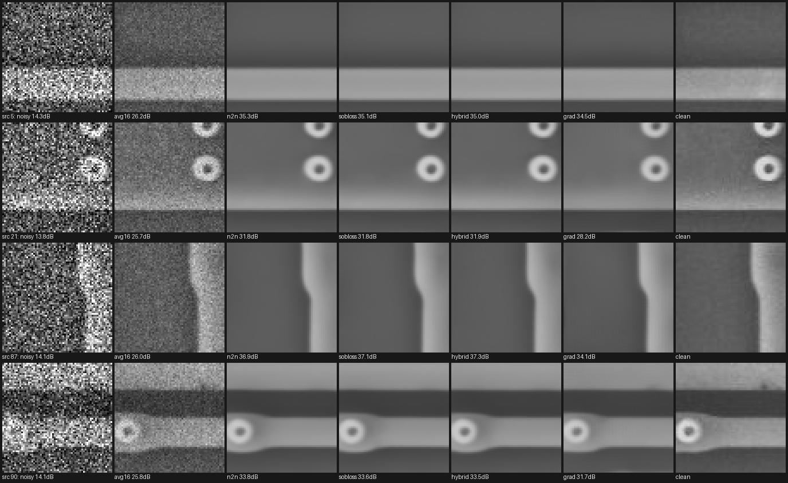
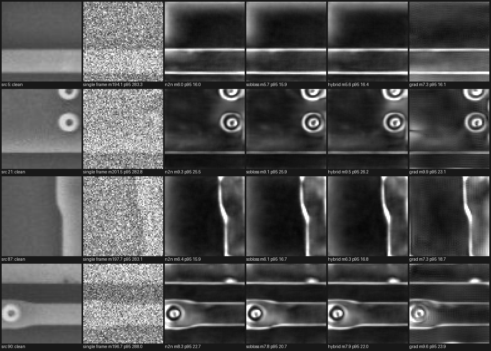
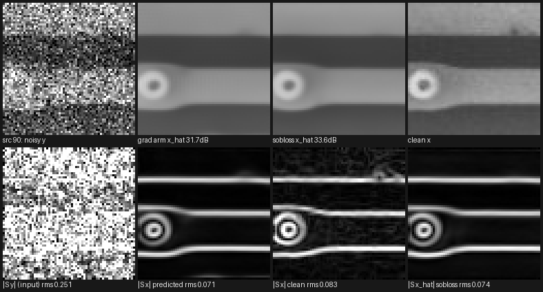

# Edge-Domain Denoising — Pilot Experiment Report

*2026-08-31 · code: [`edge_denoise/`](../) · method & derivations: [`edge_denoise_method.md`](edge_denoise_method.md) · results: `runs/edge_denoise/repeatability_val_pilot/`*

**TL;DR**

- **The pipeline is feasible and the math held exactly**: measured training
  floors landed within 2% of the derived values (image term 0.1546 vs 0.154
  predicted; gradient term 0.0283 vs 0.0289), classical/N2N rows of the
  precision table reproduce the pre-existing evaluation bit-identically, and
  sub-pixel edge positions survive the Sobel round trip to 0.004 px.
- **The literal proposal (Sobel in → Sobel out → reconstruct) is the weakest
  arm**, exactly as the method doc predicted: **−1.70 dB PSNR** (0/10 sources
  better, t = −6.5 — the only definitive effect in the pilot), CD 3σ scene
  0.651 vs N2N's 0.539 px, CD success 94.1% vs ~99%, and 2× the signed CD
  bias. The two structural handicaps (Nyquist-line null space; low-frequency
  error amplification of the inverse) are measured, not hypothetical.
- **The gradient *loss* is the active ingredient, and it is free**: adding
  $4\,\|S(f - t)\|^2$ to plain N2N (`sobloss`) matched N2N's PSNR within 0.03
  dB while improving every precision column a little — CD 3σ site-pooled
  −7.7% (1.039 → 0.959 px), CD 3σ scene better on **8/10 scenes** paired
  (0.539 → 0.533, t = −1.67, p ≈ 0.13), feature-center σ −6% (0.200 → 0.188
  px), pixel σ −2%, and **signed CD bias −28%** (+0.138 → +0.100 px, at the
  frame-averaging level).
- **The Sobel input channels added nothing beyond the loss** at this scale:
  `hybrid` ≈ `sobloss` on every metric (hybrid takes the best signed bias,
  +0.090, and shift σ, 0.142; sobloss the best CD and center σ).
- **Nothing on the precision axis reaches p < 0.05 at n = 10 scenes.** This
  was the method doc's stated expectation (§4.2: an error-shaping method, not
  a different optimum) and the pilot's stated role (direction-finder). The
  direction is consistently favorable and consistently small.

## 1. Protocol

Dataset `data/MIIC-burst-p10-dedup` (96 distinct scenes; Poisson, effective
peak 10). **Dev (val) split only — 10 sources, the locked test split was not
touched.** All arms trained with the identical recipe (8.95M-param U-Net,
64px crops, batch 8, Adam 2·10⁻⁴, EMA 0.999, seed 0, 30,000 steps, ~32 min
each on the RTX 4060 Ti); the N2N reference is the *pre-existing*
`miic_p10_dedup_n2n` burst checkpoint, reused unchanged. Every arm is its
config-fixed final step — no checkpoint selection.

| arm | representation | input | target | λ_image / λ_gradient |
|---|---|---|---|---|
| `n2n` (reference) | image | $y$ | fresh frame | 1 / 0 |
| `sobloss` | image | $y$ | fresh frame | 1 / 4 |
| `hybrid` | hybrid | $[y, S y]$ | fresh frame | 1 / 4 |
| `grad` | gradient | $S y$ | $S$(fresh frame) | 0 / 1 |

`sobloss` vs `n2n` is the cleanest pair in the study: **they differ in the
loss function only.** Evaluation:
`python -m edge_denoise repeatability ... --burst-checkpoint n2n=... --split val --seeds 10`
— one harness run, so all arms share sources, seeds, center crops, and the 37
auto-selected CD sites. Classical rows and the N2N rows reproduce the previous
standalone evaluation exactly, confirming comparability.

## 2. Results — repeatability & metrology (val, 10 sources × 10 seeds, 37 sites)

| method | PSNR dB | pixel σ ×10⁻³ | CD 3σ **scene** px | CD 3σ site px | CD bias px | CD abs-bias px | CD success | center σ px | shift σ px |
|---|---|---|---|---|---|---|---|---|---|
| single_frame | 14.13 | 195.2 | 1.452 | 2.236 | +0.091 | 0.373 | 98.6% | 0.363 | 0.353 |
| avg_of_4 | 20.13 | 97.5 | 0.735 | 1.330 | +0.111 | 0.234 | 98.0% | 0.234 | 0.166 |
| avg_of_8 | 23.12 | 68.9 | 0.550 | 1.558 | +0.080 | 0.197 | 98.6% | 0.255 | 0.131 |
| avg_of_16 | 26.08 | — | — | — | +0.048 | 0.194 | 100.0% | — | — |
| one_shot@n2n | 35.42 | 6.50 | 0.539 | 1.039 | +0.138 | 0.319 | 99.2% | 0.200 | 0.145 |
| **one_shot@sobloss** | 35.39 | **6.36** | **0.533** | **0.959** | +0.100 | 0.303 | 98.9% | **0.188** | 0.149 |
| **one_shot@hybrid** | 35.37 | 6.42 | 0.543 | 1.011 | **+0.090** | 0.316 | 98.6% | 0.195 | **0.142** |
| one_shot@grad | 33.72 | 8.50 | 0.651 | 1.124 | +0.282 | 0.415 | 94.1% | 0.204 | 0.161 |

Accuracy on frame 0 per source (`evaluate`, mean / median PSNR): hybrid
35.64 / 35.90, sobloss 35.65 / 35.83, grad 33.99 / 34.36 dB (SSIM 0.949 /
0.949 / 0.943). Training-time live monitor at 30k: `val/consistency_sigma`
9.28 (hybrid), 9.51 (sobloss), 10.71 (grad) ×10⁻³.

### 2.1 What the outputs actually look like

Real outputs on four val sources spanning the difficulty range (src 5: easy
line, src 21: hardest CD scene, src 87: worst CD σ, src 90: structured,
low-PSNR). Every model column is a single forward pass on the *same* single
noisy frame; PSNR vs clean in each caption:

The learned arms recover via rings and line edges that 16-frame averaging
still buries in grain, from one frame at 14 dB. The differences between
`n2n`, `sobloss`, and `hybrid` are — as the table says — visually negligible;
the `grad` column is recognisably softer with mild large-scale shading
errors (clearest on src 21, −3.6 dB), the low-frequency amplification of
§5.2 made visible. Note also that every learned column is *smoother than the
clean column itself*: the flats' fine grain is conditional-mean-suppressed,
not transmitted — quantified in the smoothness caveat (§6).

### 2.2 Where the outputs move between repeated acquisitions

Per-pixel repeatability σ across the same 10 seed frames the table pools
(each tile normalized to its own p99 so the *spatial pattern* is readable;
absolute mean / p95 in the captions, ×10⁻³ in [0, 1] intensity):

This is the burst report's finding 7, now measured across objectives: the raw
frame's variability is spatially uniform; every learned arm's variability
concentrates **exactly on the contours CD reads** (bright outlines around the
vias and line edges, near-black flats). The gradient loss did not remove the
edge concentration — it trimmed its magnitude slightly (p95 20.7 vs 22.7
×10⁻³ on src 90) — and the `grad` arm adds visible low-frequency blotches to
its σ maps on top (src 21, left half), which is where its extra pixel-σ
lives.

## 3. Paired analyses (per scene / per source, vs `one_shot@n2n`)

**CD 3σ per scene** (n = 10, negative = better than N2N):

| arm | mean Δ px | median Δ | better scenes | t |
|---|---|---|---|---|
| sobloss | −0.071 | −0.027 | **8/10** | −1.67 |
| hybrid | −0.016 | −0.001 | 7/10 | −0.80 |
| grad | +0.143 | +0.133 | 1/10 | +0.64 |
| avg_of_8 | +0.219 | −0.011 | 5/10 | +0.62 |

**PSNR per source** (n = 10):

| arm | mean Δ dB | better sources | t |
|---|---|---|---|
| sobloss | −0.034 | 4/10 | −1.03 |
| hybrid | −0.047 | 5/10 | −1.31 |
| grad | **−1.695** | 0/10 | **−6.47** |

**CD bias, read carefully.** The signed (systematic) bias drops ~30% with the
gradient loss (+0.138 → +0.100/+0.090 px, vs avg-of-8's +0.080). But the
per-site |bias| barely moves (0.319 → 0.303/0.316; paired per site: sobloss
improves 18/37 sites, t = −1.13; hybrid 13/37, t = −0.14). So the gradient
term removes part of the *global* edge-shift component — the part a one-time
calibration could also remove — while site-shape-dependent bias is untouched.
An honest modest win, not the bias breakthrough the signed column alone would
suggest.

## 4. Reading against the pre-registered predictions (method doc §5.3)

1. *"Hybrid improves CD/center precision over N2N at small PSNR cost"* —
   **directionally yes, weakly**: center σ and pixel σ improve 2–6%, CD is a
   statistical tie at this n; PSNR cost is real but tiny (−0.03…−0.05 dB).
2. *"Pure gradient roughly matches on CD but loses PSNR/pixel-σ visibly"* —
   **half right**: the PSNR/pixel-σ loss is exactly as predicted (−1.7 dB,
   +31% pixel σ), but CD also degraded (+0.11 px scene 3σ, success −5 pts,
   signed bias +0.28 px). The reconstruction's low-frequency error field
   evidently perturbs the profile extremes enough to move thresholds.
   **The literal gradient-only pipeline should not be pursued further in this
   form**; its useful content survives in the loss.

   The gradient domain itself, for the record — this is what that arm sees
   and produces (src 90; bottom row = Sobel magnitudes on a shared scale,
   RMS in captions):

   

   The denoising *in* the domain works well — the predicted field (RMS 0.071)
   recovers the clean edge structure (0.083) from an input field that is
   almost pure noise (0.251). What loses the race is the trip back:
   reconstruction turns small low-frequency field errors into the shading and
   softness visible in the top row (31.7 vs 33.6 dB). Note the sobloss
   output's Sobel magnitude (bottom right) matches clean's structure without
   ever leaving the image domain — the loss buys the same edge fidelity
   without the inverse problem.
3. *"sobloss lands between N2N and hybrid"* — **wrong in an informative
   way**: sobloss ≥ hybrid on most precision columns. The loss is the active
   ingredient; the input channels are (at most) neutral at 30k steps.
4. *"Learned CD bias shrinks where the gradient term is active"* — **yes for
   the systematic component (−28…−35%), no for per-site magnitude** (§3).

## 5. Verdict and recommended next steps

**Feasibility: established. Effect size at pilot scale: small, consistent,
and cheap.** The deployment-relevant recipe emerging from this pilot is
"**N2N + gradient loss**" (`sobloss`): identical cost and architecture to
plain N2N, no reconstruction machinery, PSNR-neutral, and every metrology
column equal or slightly better — with the caveat that no precision delta is
individually significant at n = 10 scenes.

1. **Seed replication × λ sweep** on `sobloss` (λ_g ∈ {2, 4, 8, 16}, ≥3
   seeds): the decisive study for whether the 0.53-vs-0.54 direction is real.
   ~32 min/run; the harness is one command per comparison.
2. **Turn on `lambda_consistency`** (implemented, validated, OFF in the
   pilot): the only term that changes the *optimum* toward lower variance
   rather than reshaping error — the direct attack on repeatability, to be
   traded against the bias it must introduce (method doc §6).
3. Only after a winner exists at seed-replication scale: **one confirmatory
   run on the locked test split.**
4. Optional diagnostics available in `repeatability_val_pilot/`:
   `sigma_maps.png` (fixed-scale variant of §2.2), per-site JSON for
   site-stratified analysis. The figures embedded above regenerate from the
   checkpoints with `python tools/edge_denoise_report_figures.py --config
   edge_denoise/configs/miic_p10_dedup_hybrid.yml --n2n-checkpoint <n2n.pt>
   --hybrid-checkpoint <...> --grad-checkpoint <...> --sobloss-checkpoint
   <...> --out edge_denoise/docs/images`.

## 6. Caveats

One training seed per arm; 10 scenes; 64px synthetic-Poisson patches; CD
sites oracle-selected on clean images; scale in pixels, not physical units.
The N2N reference was trained by the burst pipeline (T = 1) and the new arms
by edge_denoise — the recipes are verified identical (same U-Net, data,
split, seed, steps; the t-conditioning constant is 1.0 in both), but the
codepaths differ in batch assembly order, so residual trainer-level
differences of order ±0.05 dB cannot be excluded (visible as the
n2n-vs-sobloss PSNR gap, which is within that band).

**Smoothness: every learned arm outputs less fine texture than the clean
reference — by construction, and PSNR barely notices.** A tiled full-frame
diagnosis of the pilot checkpoints (2026-09-01) measured the clean sources'
flat-region grain at $\sigma_m \approx 0.005$–$0.006$ against per-frame
Poisson noise $\sigma_n \approx 0.19$: the per-pixel Wiener gain
$\sigma_m^2/(\sigma_m^2+\sigma_n^2) \approx 0.001$, so ≥ 99.9% of the grain
is unrecoverable from one frame and the conditional-mean optimum drops it.
The arms do exactly that — output flat-texture RMS ≈ 0.0007 vs clean's
0.0057, and the flat-region residual correlates with the clean image's own
grain at −0.73…−0.81: the flat "error" *is* the untransmitted grain. The
signature is identical on train scenes (no grain memorization), so it is
estimator character, not a generalization gap. PSNR is near-blind to it:
dropping all flat grain alone would still score 48–53 dB, the dropped grain
is only ~5–10% of total MSE, and 52–68% of squared error sits on the edge
mask instead. Consequences: outputs look cleaner than the ground truth they
are scored against; texture-amplitude metrics (fine-scale LER, graininess)
measured on any conditional-mean output read low; and real sub-recoverable
features go with the grain (the small dark blemish in src 90's clean crop is
largely erased by every learned arm). The grain is short-range correlated
(lag-1 ≈ +0.5 horizontal / +0.3 vertical, full-row streaks ≤ 2%, amplitude
scaling ≈ $\sqrt{I}$ — leftover acquisition noise of the source capture), so
receptive field cannot substitute for dose: revealing it requires on the
order of $m \approx I/(\text{peak}\cdot\sigma_m^2) \approx 10^3$ averaged
frames (the short-range correlation buys at most ~2–3×). Reproduce:
`python tools/diagnose_smoothness.py --config
edge_denoise/configs/miic_p10_dedup_sobloss.yml --n2n-checkpoint <n2n.pt>
--sobloss-checkpoint <...> --hybrid-checkpoint <...> --grad-checkpoint <...>`.
