# Fine Features Without Losing the Edges — Methods and Results

> **Conclusion.** The "too smooth" look has two causes, and only one is a
> limit. The 1–4 px grain of the flats is below what one frame can carry for
> *every* estimator — including the diffusion sampler — and that limit is now
> measured from the burst itself (0.1 % transmissible per frame, ≈ 830 frames
> for half). The blemishes and stains are not at a limit: the current arms
> already keep two thirds of their contrast, and a cleaner, debiased training
> target built from the burst alone lifts that to the clean-target oracle's
> level while removing most of the systematic CD bias.
> **Recommended recipe — `ft_avgdebias_b16`: fine-tune the N2N teacher on the
> leave-one-out mean of the other burst frames, pushed through the detector's
> clipping response.** Against the compute-matched control: PSNR +0.53 dB,
> signed CD bias +0.024 px (from +0.105; oracle +0.013), CD 3σ 0.461 px
> (9/10 scenes better), blemish retention 0.70 (oracle 0.72), same one-frame
> inference, no clean image. For a precision-only measurement head, the same
> target plus the consistency term gives CD 3σ 0.368 px. Generative sampling
> from a diffusion prior adds synthetic texture and lower bias, not
> information, and costs precision — keep it for display, not for CD.

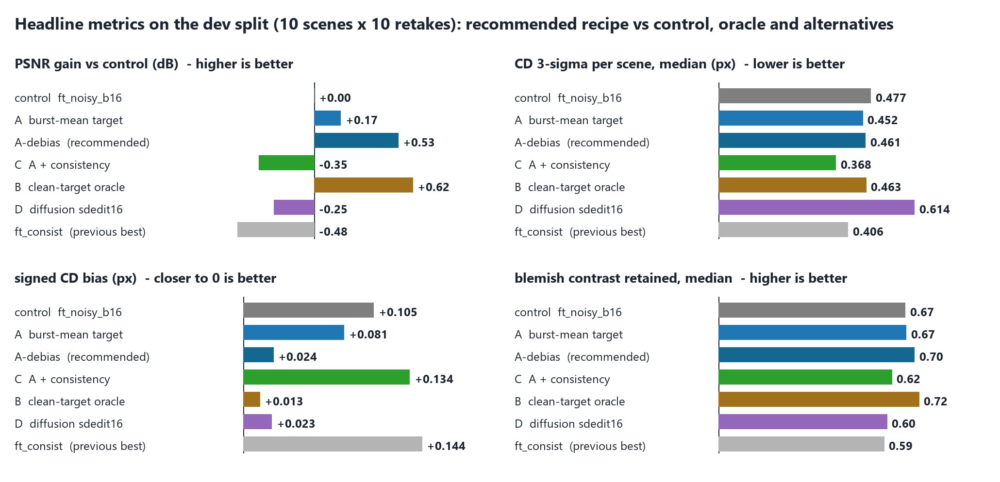

*2026-09-04/05 · code: [`edge_denoise/`](../) (`finefeat.py`, `prior.py`,
`target: noisy_mean`, `training.defect_augment`) · precedes:
[`target_ladder_report.md`](target_ladder_report.md) · results:
`runs/edge_denoise/fine_features_*/`, `runs/edge_denoise/repeatability_val_ff_*/`*

**The question.** Every arm that scores well on this project's metrology harness
(the `ft_*` fine-tunes, `ft_consist` above all) outputs images that are
*smoother than the clean reference*: the fine grain of the flats and small
blemishes visible in the clean image are gone, while a plain 16-frame average —
noisier by 10 dB — still shows the blemish. A DDIM trained on real SEM images
generates exactly this kind of fine structure from pure noise. So is the
smoothness a physical limit, or a limitation of the one-shot Noise2Noise
pipeline? This report answers that with measurements, then reports every
pipeline tried to push the boundary, with what each does, how it is trained,
why it is built that way, and what it bought on **both** axes: fine-feature
retention and edge metrology.

**TL;DR**

- **The smoothness is two things, and only one of them is a limit.** The
  grain of the flats (σ ≈ 0.006, 1–4 px) sits ~300× below the single-frame
  Poisson power at every spatial frequency; its *statistics* can be measured
  from the burst alone (cross-frame covariance: variance 4.4·10⁻⁵ ± 0.4,
  lag-1 correlation +0.47/+0.31, matching the clean images) and they say a
  one-frame estimator can transmit 0.1 % of it — ~830 frames for half. Every
  arm, oracle and diffusion sampler included, erases those bands (§1, §4).
  The blemishes and stains (2–12 px) are a different regime: the current
  arms keep ~⅔ of their contrast, rising with single-frame SNR, and invent
  none — attenuated by Bayes shrinkage, not erased, and improvable.
- **Best deployable pipeline found: the burst as an unbiased, debiased
  target (`ft_avgdebias_b16`).** Fine-tune the N2N teacher with both
  fidelity terms chasing the leave-one-out mean of the other 15 frames,
  pushed through the inverse of the detector's clipped-Poisson response.
  Same one-frame inference, no clean image. Against the compute-matched
  control: PSNR **+0.53 dB** (9/10 scenes, p = .004 — the clean-target
  oracle gets +0.62), signed CD bias **+0.024 px** (from +0.105; oracle
  +0.013), |bias| **0.241** (oracle 0.234), CD 3σ scene **0.461 px** (−0.12,
  9/10 scenes, sign p = .02), and the best fine-feature retention of any
  non-oracle arm (median **0.70**; oracle 0.72; features at SNR ≥ 1 kept at
  91 %). Most of the learned arms' systematic +0.1 px edge shift turns out to
  be the *target's* clipping bias (§5, §8).
- **Best precision point: burst-mean target + consistency
  (`ft_avgfull_consist`)**: CD 3σ scene **0.368 px** (control 0.477,
  `ft_consist` 0.406), pixel σ 4.40·10⁻³ (−28 %, 10/10 scenes), at −0.35 dB
  and with the consistency term's bias cost unchanged.
- **Seed replication (3 seeds × 2 arms):** the burst-mean target beats the
  control in every seed pairing on PSNR (+0.13…+0.21 dB, p < .01 each) and
  pixel σ (9/10 scenes each), and on CD 3σ in 7–9 of 10 scenes per pairing
  (−0.04…−0.19 px; t-tests p = .09–.26 — single-scene spread dominates at
  n = 10). Fine-feature retention gains (+0.02…+0.04 median, +0.04 at
  SNR ≥ 1) reproduce across seeds.
- **The diffusion route, done properly, does not recover more fine
  structure.** A DDPM prior on clean train crops, conditioned on one frame
  (SDEdit-style chain from the frame's own noise level; the exact-likelihood
  chain is documented but failed), matches N2N's PSNR and inherits the
  prior's *unclipped* bias (+0.02 px) — but costs 41 % pixel σ and +0.2 px CD
  as a single sample (an 8-chain mean recovers the control's CD at 200× the
  cost), keeps the grain bands at gain 0.04, adds texture *uncorrelated* with
  the true grain, and retains **less** of the blemishes (0.60 vs 0.68).
  Sampling buys texture and bias, not information (§6).
- **Two hypotheses the user's intuition suggested are closed with data:**
  deterministic scheduling (the burst-diffusion 15-step iteration) is
  identical to one-shot on every fine-feature metric (§4); enriching the prior
  with synthetic defects does not raise retention of the real ones (0.67 vs
  0.68) and does not hallucinate (§7) — the shrinkage is evidence-limited,
  not rarity-limited.
- Recommended pipeline and next steps in §10.

## 1. Two regimes, measured not assumed

"Fine features" hides two things with opposite physics. The diagnostic built for
this study (`python -m edge_denoise fine-features`, §3) separates them; the
short version first.

### 1.1 Pixel grain: statistically measurable, not recoverable

The flats of the MIIC "clean" images are not flat: they carry a grain of RMS
$\sigma_m \approx 0.006$ (in [0, 1] intensity) with lag-1 autocorrelation
$+0.5$ horizontally and $+0.3$ vertically — the leftover acquisition noise of
the long-dwell source capture, streaked by the scan. A single synthetic frame
adds Poisson noise of variance $\sigma_n^2 = I/10 \approx 0.037$ on top. The
linear (Wiener) recovery gain of the grain from one frame is
$\sigma_m^2/(\sigma_m^2+\sigma_n^2) \approx 0.001$ **at every spatial
frequency**: the grain's spectrum is only mildly concentrated (the lag-1
correlation buys ~3× at the low end), so nowhere does it approach the noise
floor.

This is *not* a synthetic-land artefact and it needs no clean image to
establish. Take two frames $y_i, y_j$ of a burst, high-pass each against a
baseline built from **disjoint** halves of the other 14 frames, and correlate:
the noise terms are all independent and drop out, so the cross-frame covariance
of the high-passed pair is an unbiased estimate of the content common to every
frame — the grain. Pooled over the 10 dev scenes and 600 frame pairs:

| quantity | from the clean images | from the burst alone |
|---|---|---|
| grain variance | 4.1·10⁻⁵ | **4.4·10⁻⁵ ± 0.4·10⁻⁵** |
| lag-1 autocorrelation (h / v) | +0.49 / +0.30 | **+0.47 / +0.31** |
| single-frame high-pass noise variance | — | 0.0366 |
| implied Wiener gain, 1 frame / 16 frames | — | 0.0012 / 0.019 |
| frames for 50 % recovery | — | **≈ 830** |

So an instrument can *measure* its own grain statistics from a burst and
conclude that a one-frame estimator cannot transmit that grain's realization:
any grain in a one-frame output is synthesized. The previous report's
"thousands of frames" figure was right — for the grain, and only for the grain.
It said nothing about the second regime.

### 1.2 Structured features: recoverable, and where the pipeline was losing

A blemish, scratch or stain is a *coherent* deviation over many pixels. Its
single-frame matched-filter SNR is $c\sqrt{A}/\sigma_n$ for contrast $c$ over
area $A$: a stain of contrast 0.04 over 100 px has SNR ≈ 2, a 0.06 stain over
150 px SNR ≈ 3.5. That is the same evidence a human reads in the 16-frame
average (SNR × 4). The information is in the frame. What a conditional-mean
estimator does with it is dictated by Bayes: it shows the feature at
(contrast × posterior probability), and the posterior probability is the
likelihood evidence *times the prior odds*. A network whose prior was fitted on
76 scenes where such stains are rare assigns them low prior odds, and the
product is a faint smudge — the erasure the user pointed at. **This regime is
where a pipeline can win, and it is the target of every arm below.**

### 1.3 What the DDIM observation actually shows

In a DDIM sample, the $\hat x_0$ prediction at step ~50 of 100 is the posterior
mean given a state whose noise is about one measurement's worth — smooth, like
N2N. The fine features that appear between steps 50 and 100 are *drawn from the
prior* as the chain commits to one realization; they are not measured. Mapped
onto denoising, the exact analogue is posterior sampling: the N2N output is the
$\hat x_0$ at the measurement's noise level, and continuing the chain to zero
produces a sample with prior-typical grain and *committed* structured features
(present at full contrast in a fraction of samples equal to their posterior
probability). That is arm D below, run with the exact likelihood of the stored
frames so its metrology cost can be measured rather than argued.

## 2. Methods tried

All arms train on `data/MIIC-burst-p10-dedup` (76 train / 10 dev scenes, the
locked test split untouched), warm-start from the same N2N teacher, and share
the 8.95M-parameter U-Net, the sobloss objective ($\lambda_i = 1$,
$\lambda_g = 4$), Adam 2·10⁻⁴, EMA 0.999 and 10,000 steps. The matched control
is `ft_noisy_b16` (batch 16, fresh-frame target: 16 network inputs per step,
the same per-step cost as the consistency arms). Every arm is scored on the
repeatability harness (CD 3σ per scene, bias, center/shift σ, pixel σ, PSNR;
paired per scene with `python -m burst_diffusion paired`) **and** on the
fine-feature diagnostic (§3).

| arm | what changes | why |
|---|---|---|
| **A `ft_avgfull_b16`** | both fidelity targets = leave-one-out mean of the other 15 replicas (`target: noisy_mean`) | The fresh-frame target carries full $\sigma_n^2$; the burst already contains a 15-frame mean with 1/15 of it, still unbiased (the input's own noise never enters the target). The per-step gradient signal for rare low-contrast structure is 15× cleaner; inference stays one frame. Deployable — bursts exist at training time. |
| **A-debias `ft_avgdebias_b16`** | A, with the leave-one-out mean pushed through $g^{-1}$, $g(x) = \mathbb{E}[\min(\mathrm{Pois}(10x),10)]/10$ (`objective.target_debias_peak`) | The stored frames are clipped, so their mean sits below $x$ (by 0.06 at the bright end) and every noisy-target arm regresses onto a compressed edge profile; $g$ is monotone and known, so the burst mean can be debiased before use. Deployable wherever the detector response is calibrated. Added after §5 exposed the bias origin. |
| **B `ft_cleanfull_b16`** | both fidelity targets = clean | The ceiling for *any* unbiased target. If zero target noise still leaves the structure erased, target noise was never the limit. Synthetic-land only. |
| **C `ft_avgfull_consist`** | A + $\lambda_c = 1$ (batch 8, two forward passes) | The precision winner of the ladder on the cleaner target: does the consistency term's CD gain survive, and does the cleaner target reduce its PSNR/bias cost? |
| **D posterior sampling** (`dps`, `dps_mean`, `sdedit`) | a DDPM prior on clean train crops + the exact clipped-Poisson likelihood of one frame | The user's intuition made exact (§1.3). `dps`: DDIM from a fixed Gaussian start with the likelihood applied as a per-pixel proximal step on the chain's $\hat x_0$ (the textbook gradient form collapsed, §6) — deterministic given the frame. `dps_mean`: the average of K such samples, walking back toward the posterior mean. `sdedit`: place the frame at the matching noise level and run the chain down — the literal "start at step 50" picture. |
| **E `ft_avgfull_aug_b16`** | A + synthetic soft defects added to *every* frame of half the training windows | Tests whether the erasure is prior-driven: raise the prior odds of blobs and scratches without touching the Noise2Noise argument (the same field on input and target keeps them independent). If real val blemishes come back, the limit was the prior; the false-feature rate says whether it also paints defects into noise. |

Objective per arm, phase 2 (phase 1 is the shared N2N teacher, $d(f(y_i), y_j)$,
30k from scratch); $\bar y_{-i} = \tfrac1{15}\sum_{m\ne i} y_m$, $S$ = Sobel:

- A: $d\big(f(y_i),\bar y_{-i}\big) + 4\,d\big(S f(y_i), S\bar y_{-i}\big)$
- A-debias: A with $\bar y_{-i} \to g^{-1}(\bar y_{-i})$ (pixelwise table lookup)
- B: $d\big(f(y_i), x\big) + 4\,d\big(S f(y_i), S x\big)$
- C: A $+\; d\big(f(y_i), f(y_k)\big)$, $k \ne i$
- E: A on $(y_m + \delta)_m$ with one random defect field $\delta$ per sample
- D: prior $\epsilon_\theta$ trained with $\|\epsilon_\theta(\sqrt{\bar\alpha_t}x + \sqrt{1-\bar\alpha_t}\epsilon, t) - \epsilon\|^2$ on clean crops; sampling with $\epsilon' = \epsilon_\theta - \sqrt{1-\bar\alpha_t}\,\nabla_{x_t}\log p(k \mid \hat x_0(x_t))$, $k$ = the stored counts, $p$ = Poisson with the top bin $P(K \ge 10)$ (the stored frames are exactly $\min(\mathrm{Pois}(10x),10)/10$; the clipped-bin probability predicted 0.318 vs 0.324 observed).

### 2.1 The training flows, illustrated

Each illustration uses real 64-px crops of dev scene 48 (the harness crop):
the frames, targets and outputs shown are the actual tensors of that sample.

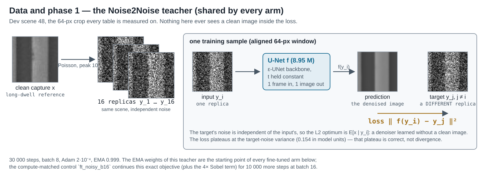

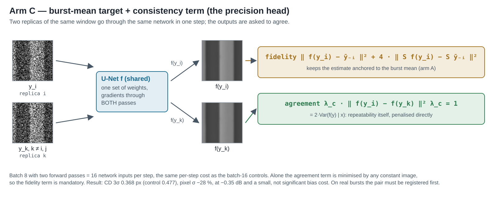

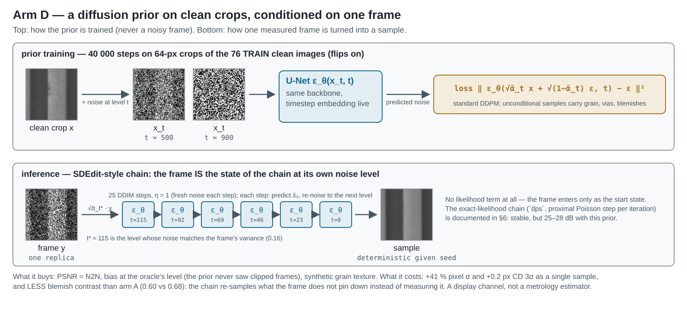

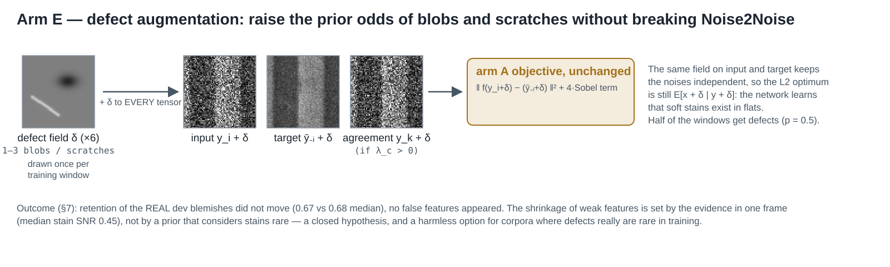

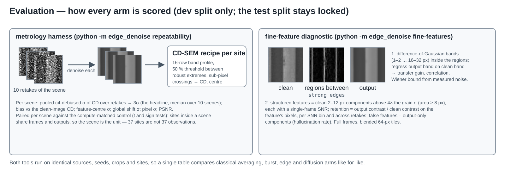

## 3. The fine-feature diagnostic

`python -m edge_denoise fine-features` scores full 512² frames (blended
64-px tiles, stride 48) of the dev scenes:

- **Regions.** Strong edges (smoothed gradient > 0.015, dilated 3 px) are
  removed; what remains — the areas between the pattern edges, blemishes
  included — is split into connected regions. Every Gaussian blur below is
  confined to its region (normalized convolution per region), so neither an
  edge ramp nor the neighbouring plateau can ring into a flat's statistic.
- **Per-band transfer.** Difference-of-Gaussian bands (1–2, 2–4, 4–8, 8–16,
  16–32 px). In the regions, the output band is regressed on the clean band:
  the slope is the transfer *gain* (1 = transmitted, 0 = erased), the
  correlation says whether what is emitted is the true structure, and the RMS
  ratio is band energy regardless of truth (energy without correlation is
  hallucination). Next to each arm: the linear Wiener bound from the measured
  clean and noise band powers, for 1 and for 16 frames.
- **Structured features.** Connected components of the clean 2–12 px band above
  4× its robust σ (floor 0.004), area ≥ 8 px. Each carries a single-frame SNR;
  each arm's *retention* is its own band contrast over the feature's pixels
  divided by the clean contrast, reported per SNR bin and across 4 retakes
  (is the feature shown consistently?). *False features* are output components
  above the same threshold that overlap no clean feature.

## 4. Where the existing arms stand (baseline diagnostic)

`runs/edge_denoise/fine_features_baseline/` — 10 dev scenes, 4 retakes, 112
structured features found in the clean flats.

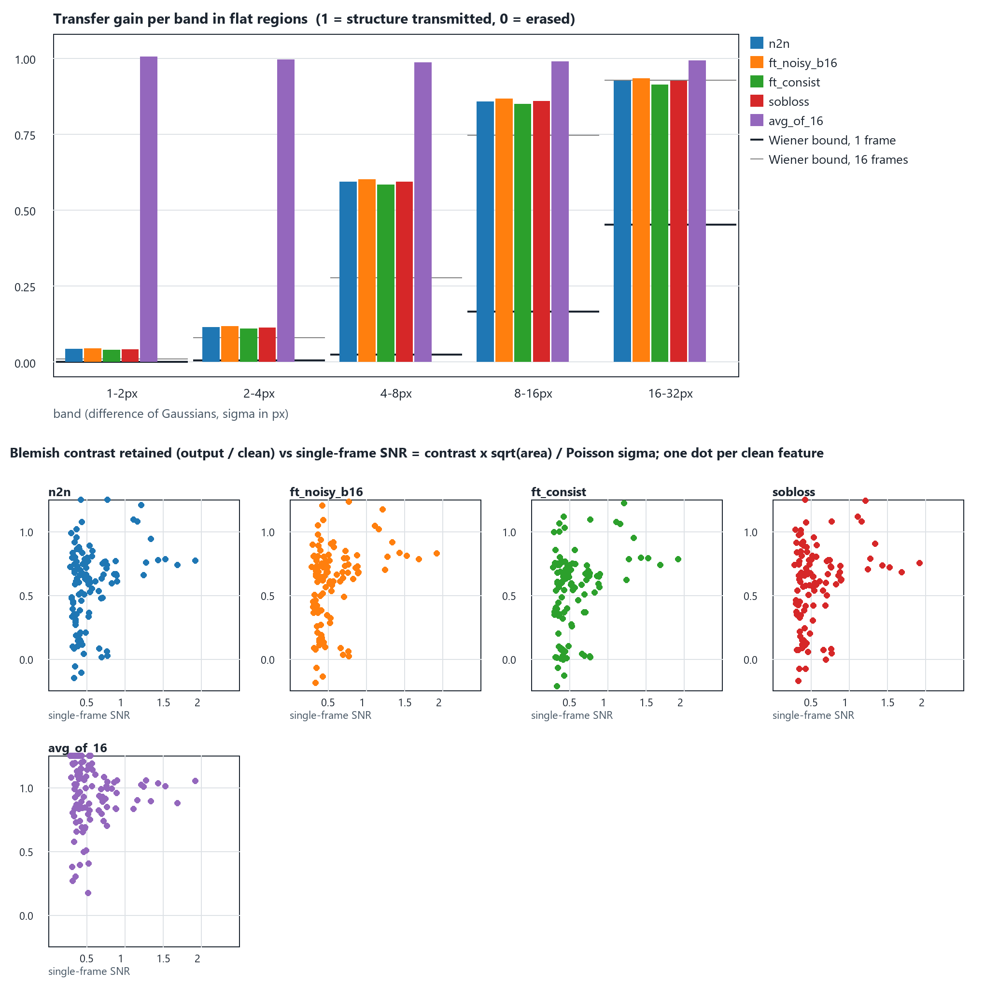

**Per-band transfer gain** (flat regions; `corr` in parentheses):

| method | 1–2 px | 2–4 px | 4–8 px | 8–16 px | 16–32 px |
|---|---|---|---|---|---|
| clean band RMS ×10⁻³ | 4.3 | 2.7 | 2.8 | 4.0 | 4.4 |
| noise band RMS ×10⁻³, 1 frame | 166.9 | 36.1 | 18.0 | 9.1 | 4.8 |
| **Wiener bound, 1 frame** | 0.001 | 0.005 | 0.024 | 0.166 | 0.453 |
| Wiener bound, 16 frames | 0.010 | 0.080 | 0.277 | 0.747 | 0.927 |
| avg_of_16 | 1.00 (0.10) | 1.00 (0.28) | 0.99 (0.52) | 0.99 (0.86) | 0.99 (0.96) |
| n2n | 0.041 (0.11) | 0.113 (0.28) | 0.592 (0.76) | 0.857 (0.92) | 0.924 (0.95) |
| ft_noisy_b16 (control) | 0.043 (0.11) | 0.116 (0.29) | 0.600 (0.77) | 0.866 (0.93) | 0.932 (0.95) |
| ft_consist | 0.039 (0.11) | 0.108 (0.29) | 0.583 (0.76) | 0.849 (0.92) | 0.912 (0.95) |
| sobloss | 0.039 (0.11) | 0.111 (0.29) | 0.592 (0.76) | 0.858 (0.92) | 0.925 (0.95) |

Three readings:

1. **The learned arms erase the 1–4 px bands** (gain 0.04 / 0.11) — that is
   the grain, and the linear bound there is 0.001 / 0.005. Even the erased
   bands are transmitted 10–40× *above* the linear bound: the prior is
   working, the information is not there.
2. **At 4–8 px the arms transmit 59 % with correlation 0.76, twenty-five times
   the Wiener bound (0.024)**; at 8–16 px 86 %. "Too smooth" is,
   quantitatively, a 1–8 px story, and the 4–8 px band — where small
   blemishes live — is the recoverable part that the current arms only
   half-deliver.
3. `ft_consist` sits lowest in every band (0.912 vs 0.932 at 16–32 px): the
   agreement term buys its repeatability partly by smoothing. Not large, but
   measurable, and a reason to pair it with a cleaner target (arm C).

**Structured features** (112; retention = output contrast / clean contrast on
the feature's own pixels; `false` = output-only features per 1000 flat px):

| method | retention median | mean | > 0.5 | retake std | false /1000 px | SNR < 0.4 (37) | 0.4–0.6 (43) | 0.6–1 (22) | ≥ 1 (10) |
|---|---|---|---|---|---|---|---|---|---|
| avg_of_16 | 0.99 | 1.00 | 94 % | — | 4.46 | 1.03 | 1.00 | 0.93 | 1.01 |
| avg_of_4 | 0.99 | 1.00 | 94 % | 0.55 | 10.35 | 1.03 | 1.00 | 0.93 | 1.01 |
| n2n | 0.63 | 0.57 | 66 % | 0.11 | 0.02 | 0.48 | 0.63 | 0.64 | 0.78 |
| ft_noisy_b16 | 0.67 | 0.59 | 68 % | 0.10 | 0.02 | 0.50 | 0.62 | 0.68 | 0.83 |
| ft_consist | 0.59 | 0.53 | 64 % | 0.07 | 0.01 | 0.54 | 0.59 | 0.59 | 0.79 |
| sobloss | 0.65 | 0.58 | 67 % | 0.11 | 0.02 | 0.54 | 0.64 | 0.62 | 0.77 |

The blemishes are **attenuated, not erased**: the learned arms keep about two
thirds of their contrast, rising with single-frame SNR exactly as the Bayesian
picture predicts (the four src 90 stains at SNR 1.4–1.9 keep 78–83 %; the
smallest, SNR < 0.4, keep ~50 %), and they invent essentially nothing (0.02
false features per 1000 px, against 4.5 for a 16-frame average and 10 for a
4-frame average, whose "features" are noise). Every feature in this corpus is
weak — median SNR 0.45, i.e. a 1.8σ detection in one frame and a 7σ detection
in 16 — so 60–80 % retention from one frame is a strong prior at work, not a
failure. `ft_consist` again trades a little contrast (0.59) for the smallest
retake spread (0.07): what it shows, it shows consistently.

**Deterministic scheduling does not change this.** The burst-diffusion
iterative sampler — a deterministic 15-step chain conditioned on a pseudo-
average, the closest existing relative of "a schedule instead of one shot" —
was scored the same way (`runs/edge_denoise/fine_features_scheduled/`):

| method | gain 1–2 / 2–4 / 4–8 px | retention median | retake std |
|---|---|---|---|
| burst 30k, one-shot | 0.041 / 0.115 / 0.606 | 0.58 | 0.17 |
| burst 30k, 15-step iteration | 0.047 / 0.114 / 0.613 | 0.61 | 0.13 |
| rollout-finetuned 40k, one-shot | 0.043 / 0.117 / 0.609 | 0.64 | 0.17 |
| rollout-finetuned 40k, 15-step iteration | 0.043 / 0.113 / 0.595 | 0.63 | 0.11 |

Iterating a deterministic conditional-mean estimator re-reads the same frame;
it cannot commit to structure the frame does not support. The step-50-to-100
behaviour of a DDIM comes from *sampling*, which is arm D.

## 5. Arms A–C: cleaner targets (one seed; seeds in §8)

`runs/edge_denoise/repeatability_val_ff_phase1/` (10 scenes × 10 seeds, 37 CD
sites) and `runs/edge_denoise/fine_features_phase1/`.

**Metrology (val):**

| method | PSNR dB | pixel σ ×10⁻³ | CD 3σ scene px | CD 3σ site px | CD bias px | \|bias\| px | center σ px | shift σ px |
|---|---|---|---|---|---|---|---|---|
| ft_noisy_b16 (control) | 35.62 | 6.10 | 0.477 | 0.881 | +0.105 | 0.290 | 0.178 | 0.145 |
| ft_consist (ladder winner) | 35.14 | 4.52 | 0.406 | 0.723 | +0.144 | 0.371 | 0.159 | 0.122 |
| **A ft_avgfull_b16** | 35.79 | 5.82 | 0.452 | 0.790 | +0.081 | 0.277 | 0.168 | 0.136 |
| B ft_cleanfull_b16 (oracle) | 36.24 | 6.02 | 0.463 | 0.734 | **+0.013** | **0.234** | 0.161 | 0.138 |
| **C ft_avgfull_consist** | 35.28 | **4.40** | **0.368** | 0.760 | +0.134 | 0.359 | 0.167 | **0.122** |

**Paired per scene vs the control** (n = 10; CD is 3σ; Δ < 0 = better except PSNR):

| arm | CD 3σ: Δ px / better / p(t) / p(sign) | \|bias\|: Δ / p | pixel σ: Δ ×10⁻³ / better / p | PSNR: Δ dB / better / p |
|---|---|---|---|---|
| A ft_avgfull_b16 | −0.076 / 8/10 / .13 / .11 | −0.022 / .11 | −0.28 / 9/10 / .002 | **+0.17 / 10/10 / .0001** |
| B ft_cleanfull_b16 | −0.111 / 7/10 / .15 / .34 | −0.114 / .19 | −0.08 / 6/10 / .29 | **+0.62 / 9/10 / .001** |
| C ft_avgfull_consist | −0.083 / 9/10 / .32 / **.02** | +0.204 / .30 | **−1.70 / 10/10 / <10⁻⁴** | −0.35 / 2/10 / .015 |
| C vs ft_consist | +0.011 / 3/10 / .67 | −0.032 / .30 | −0.12 / 8/10 / .03 | **+0.13 / 10/10 / .002** |

**Fine features:**

| method | gain 4–8 / 8–16 / 16–32 px | retention median / mean | SNR 0.4–0.6 / 0.6–1 / ≥1 | retake std | false /1000 px |
|---|---|---|---|---|---|
| ft_noisy_b16 (control) | 0.600 / 0.866 / 0.932 | 0.669 / 0.590 | 0.62 / 0.68 / 0.83 | 0.101 | 0.02 |
| A ft_avgfull_b16 | 0.606 / 0.874 / 0.938 | 0.673 / 0.594 | 0.64 / 0.73 / 0.86 | 0.086 | 0.01 |
| B ft_cleanfull_b16 | 0.618 / 0.883 / 0.944 | **0.718 / 0.627** | 0.69 / 0.76 / 0.91 | 0.091 | 0.02 |
| C ft_avgfull_consist | 0.590 / 0.850 / 0.912 | 0.621 / 0.555 | 0.62 / 0.63 / 0.84 | **0.059** | 0.01 |

What the ladder says:

- **The burst-mean target is a free, deployable improvement on every axis.**
  Same inference, same compute, no clean image: +0.17 dB (10/10 scenes),
  pixel σ −5 % (9/10), CD 3σ −0.076 px (8/10), lower bias, better-supported
  features shown 3–5 points brighter and more consistently across retakes.
  The CD/bias deltas are directional at one seed (§8 adds seeds).
- **Target noise was only part of the fine-feature story.** The oracle, with
  zero target noise, reaches a median retention of 0.72 (features at SNR ≥ 1:
  0.91) — the burst mean captures 40 % of the oracle's PSNR gain and about a
  third of its retention gain. What the oracle *cannot* do is transmit the
  grain (its 1–4 px gains are 0.04 / 0.12, the same as everyone's). The rest
  of the gap to full contrast is the conditional-mean shrinkage of §1.2; only
  a change of prior (arm E) or a change of estimator (arm D) can move it.
- **The systematic CD bias is largely the target's clipping bias.** Signed CD
  bias: control +0.105, burst mean +0.081, oracle **+0.013 px**. The stored
  frames are `min(Pois(10x), 10)/10`, so every noisy-target arm regresses onto
  the clipped mean $g(x) < x$, which compresses the bright side of every edge
  profile and shifts its 50 % crossing. The audit backlog's item B3 is not a
  footnote — it is the origin of most of the +0.1 px. Because $g$ is monotone
  and known, the burst mean can be pushed through $g^{-1}$ before use; that is
  arm A-debias (§7).
- **Consistency + burst mean is the new precision point**: CD 3σ scene
  0.368 px (pixel σ −28 % vs control, 10/10 scenes), PSNR cost reduced from
  −0.48 to −0.35 dB against the control (+0.13 dB vs `ft_consist`, 10/10),
  bias cost unchanged and still not significant at n = 10. Its features are
  the most consistently shown of any arm (retake std 0.059) at a small
  contrast cost (0.62 median).

## 6. Arm D: the diffusion prior and posterior sampling

**The prior.** A DDPM (linear β, ε-prediction, T = 1000) on random 64-px crops of
the 76 train-split clean images, flips on, 40k steps at batch 16 (83 min),
`runs/edge_denoise/miic_p10_dedup_prior/`. Its unconditional samples carry the
things the regression arms never emit: grain in the flats, soft blemishes,
vias and line ends with correct shading (TensorBoard `prior/samples`,
reproduced below). Nothing from the dev or test scenes was seen.

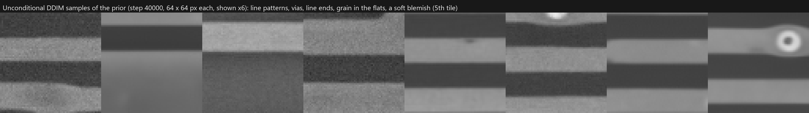

**Two ways to condition it on one frame** (`edge_denoise/prior.py`):

- `sdedit`: place the frame at the timestep whose noise matches the frame's
  variance ($\bar\alpha_{t^*}$ with $(1-\bar\alpha)/\bar\alpha = v$; $v = 0.16$
  in model units is the single-frame Poisson variance at the corpus mean
  intensity, $t^* \approx 115$) and run a 25-step DDIM chain to zero. This is
  the user's "step 50 → 100" picture, literally: the chain starts where the
  N2N estimate would be its $\hat x_0$. With $\eta = 1$ the chain is
  DDPM-stochastic; a fixed seed keeps it a deterministic function of the frame.
  No likelihood term at all — the approximation is Gaussian noise of one
  global variance, which Poisson noise is not.
- `dps`: DDIM from pure noise with the *exact* clipped-Poisson likelihood of
  the stored counts. The textbook gradient form (classifier guidance through
  $\hat x_0$) collapsed outright (≈ 10 dB, pixels pinned at the dark rail):
  the Poisson log-likelihood's gradient grows like $1/x$ at low intensity and
  ε-space steps of any fixed size overshoot. Replaced by a per-pixel proximal
  step, $\hat x_0 \leftarrow \arg\min_x \mathrm{NLL}(k \mid x) + \|x - \hat
  x_0\|^2 / 2r_t^2$ (DiffPIR-style, Newton on the convex per-pixel objective,
  $r_t^2$ = the prior's posterior variance at that step), which is stable but
  faces a genuine trade with this prior: a weak pull ($\rho \le 0.5$) lets the
  chain drift to prior-typical content (bands misplaced), a strong one
  ($\rho \ge 5$) copies the frame's noise into the sample. Stochastic
  re-noising ($\eta = 1$) helps; the best cell ($\rho = 2$) still lands at
  25–26 dB per sample, 28 dB as an 8-sample mean, against N2N's 33 dB on the
  tuning crops. It is reported below as `dps2` for completeness, not as a
  candidate.

**Metrology (val, `runs/edge_denoise/repeatability_val_ff_posterior/`):**

| method | PSNR dB | pixel σ ×10⁻³ | CD 3σ scene px | CD bias px | \|bias\| px | center σ px | shift σ px | forwards / tile |
|---|---|---|---|---|---|---|---|---|
| ft_noisy_b16 (control) | 35.62 | 6.10 | 0.477 | +0.105 | 0.290 | 0.178 | 0.145 | 1 |
| ft_avgfull_b16 (A) | 35.79 | 5.82 | 0.452 | +0.081 | 0.277 | 0.168 | 0.136 | 1 |
| sdedit16 (v = 0.16, η = 1) | 35.37 | 8.58 | 0.614 | **+0.023** | **0.205** | 0.206 | 0.172 | 25 |
| sdedit25 (v = 0.25) | 35.08 | 7.92 | 0.536 | +0.030 | 0.238 | 0.208 | 0.161 | 25 |
| sdedit40 (v = 0.40) | 34.59 | 7.65 | 0.510 | +0.051 | 0.271 | 0.218 | 0.165 | 25 |
| sdedit25, mean of 8 chains | 35.40 | 6.76 | 0.479 | **+0.019** | 0.243 | 0.185 | 0.139 | 200 |
| dps2 (proximal, ρ = 2, η = 1) | 27.25 | 36.1 | 1.072 | +0.201 | 0.343 | 0.363 | 0.265 | 100 (+ Newton) |

Paired vs the control (n = 10 scenes): `sdedit16` CD 3σ +0.22 px (2/10 better,
p = .02), pixel σ +41 % (0/10, p < 10⁻⁴), PSNR −0.25 dB (p = .18), |bias|
−0.14 px (8/10, p = .11), signed bias −0.14 px (7/10, p = .16). The 8-chain
mean: CD +0.045 px (p = .24), pixel σ +11 % (p = .007), PSNR −0.22 (p = .13),
|bias| −0.08 px (8/10, p = .15).

Three things the sampler establishes:

- **Sampling costs precision, as the perception–distortion argument says it
  must.** A single stochastic chain has 41 % more pixel σ and +0.2 px CD 3σ
  than the control; averaging 8 chains walks that back to the control's CD
  (0.479 vs 0.477) at 200× the inference cost. A retake commits to different
  fine details, and CD-SEM metrology sees that as noise.
- **The prior is unbiased where the noisy targets are not.** Every `sdedit`
  variant has a signed CD bias of +0.02–0.05 px — the level of the
  clean-target oracle (+0.013) and of frame averaging (+0.048) — against
  +0.10–0.14 for every noisy-target arm. The prior was fitted to *unclipped*
  clean images, so it never learned the clipped-mean shift of §5. This is the
  second, independent confirmation that the +0.1 px systematic bias is
  target-borne.
- **`dps` is not a usable estimator here** (27 dB, CD 1.07 px); the report
  keeps it because its failure mode is informative: with a prior this small
  (76 scenes, 40k steps) the exact-likelihood chain has no regime that is
  both structurally faithful and noise-free.

**Fine features (`runs/edge_denoise/fine_features_posterior/`, 2 retakes):**

| method | gain 1–2 / 2–4 / 4–8 / 8–16 px | corr 4–8 px | texture RMS flat ×10⁻³ | corr(resid, grain) | retention median / mean | SNR 0.6–1 / ≥ 1 | retake std | false /1000 px |
|---|---|---|---|---|---|---|---|---|
| ft_avgfull_b16 (A) | 0.042 / 0.117 / 0.606 / 0.874 | 0.772 | 0.79 | −0.78 | 0.679 / 0.590 | 0.69 / 0.88 | 0.076 | 0.01 |
| sdedit16 | 0.042 / 0.115 / 0.595 / 0.858 | 0.741 | 1.41 | −0.74 | 0.604 / 0.587 | 0.68 / 0.87 | 0.108 | 0.03 |
| sdedit25 | 0.039 / 0.109 / 0.584 / 0.845 | 0.743 | 1.27 | −0.74 | 0.589 / 0.559 | 0.65 / 0.85 | 0.085 | 0.03 |
| sdedit40 | 0.035 / 0.104 / 0.576 / 0.835 | 0.740 | 1.21 | −0.73 | 0.580 / 0.536 | 0.63 / 0.80 | 0.071 | 0.02 |
| avg_of_16 | 1.00 / 1.00 / 0.99 / 0.99 | 0.515 | 44.3 | 0.00 | 0.994 / 0.995 | 0.93 / 1.01 | — | 4.46 |

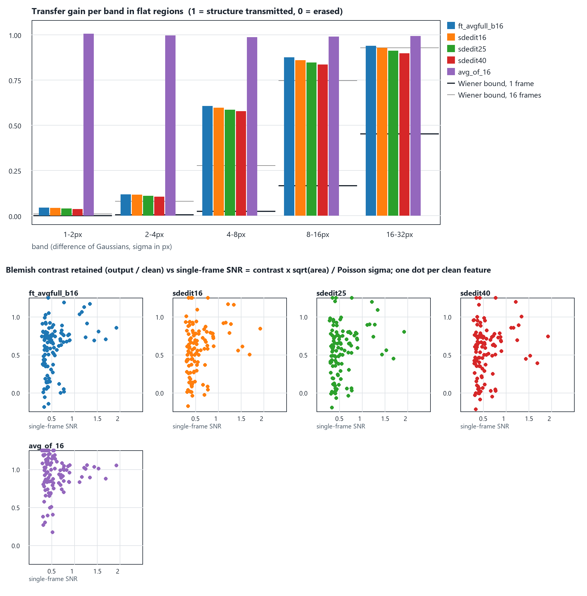

**This is the decisive negative result of the study, and it is the one the
user's intuition predicted the other way.** Conditioning the diffusion prior
on one frame — at the frame's own noise level or above it — does *not*
transmit more fine structure than the regression estimator:

- The grain bands are erased exactly as by N2N (1–2 px gain 0.04, 2–4 px
  0.11), and what the chain adds in the flats is texture *uncorrelated* with
  the true grain (texture RMS 1.2–1.4·10⁻³ vs 0.8 for arm A, residual–grain
  correlation unchanged at −0.74): a sample of the prior's grain, not the
  scene's. Starting higher up the chain (`sdedit40`) adds more of it and
  loses more of everything else.
- Structured-feature retention is *lower* than arm A's (0.60 vs 0.68 median;
  the SNR ≥ 1 stains 0.87 vs 0.88, the mid-SNR ones 0.68 vs 0.69), band
  correlations are lower at every scale (0.74 vs 0.77 at 4–8 px), and the
  outputs vary more between retakes (0.108 vs 0.076). Sampling replaces
  measured evidence with prior-typical structure; it does not add evidence.

Why the DDIM impression is misleading here: the step-50-to-100 details in an
unconditional sample are drawn from the prior, which was fitted to long-dwell
images where the grain is *visible*. A chain that starts from one noisy frame
has the same prior, but its state at the matching level carries the frame's
information and nothing more — the same information N2N had. The chain can
only re-sample what the frame does not pin down, and on this corpus that is
the grain (unrecoverable, §1.1) and the low-SNR tails of the blemishes. Arm D
therefore buys **texture and bias**, not features: a visually "grainy",
low-bias output at a measured precision cost. For metrology the recommendation
is the regression estimator; for a display/QC channel the `sdedit16` output is
a reasonable perceptual companion, with the explicit caveat that its grain is
synthetic.

## 7. Arm E: is the erasure prior-driven? (defect augmentation)

`ft_avgfull_aug_b16` = arm A with half of the training windows receiving 1–3
synthetic soft defects (Gaussian blobs of 1.5–6 px or scratches, ±0.02–0.08
contrast) added to *every* frame of the window (`training.defect_augment`),
so the Noise2Noise independence argument is untouched while the prior odds of
blob-like structure in flats go up by orders of magnitude.

| method | PSNR | CD 3σ scene | \|bias\| | retention median / mean | SNR 0.4–0.6 / 0.6–1 / ≥ 1 | false /1000 px |
|---|---|---|---|---|---|---|
| ft_avgfull_b16 (A, seeds 1/2) | 35.80 / 35.77 | 0.476 / 0.473 | 0.280 / 0.296 | 0.682 / 0.678 · 0.596 / 0.600 | 0.65 / 0.71 / 0.85–0.86 | 0.02 |
| ft_avgfull_aug_b16 (E) | 35.77 | 0.478 | 0.279 | 0.670 · 0.605 | 0.66 / 0.71 / 0.85 | 0.02 |

Nothing moves: retention of the *real* blemishes is within seed spread of
arm A at every SNR, no false features appear, PSNR and CD are unchanged.
Raising the prior odds of defects did not raise the posterior contrast the
network assigns to real ones. Combined with the oracle's ceiling (0.72) this
closes the hypothesis: the ⅓ of contrast the conditional mean withholds is
governed by the *evidence* in one frame (median feature SNR 0.45), not by a
prior that thinks defects are rare. Augmentation is not harmful and stays
available for corpora where defects genuinely are rare in training, but it is
not a lever on this one.

## 8. Arm A-debias: the burst-mean target through the detector response

`runs/edge_denoise/repeatability_val_ff_final/`, `fine_features_final/`.

**How to read the gallery.** Every crop below carries a stain that is obvious
in the clean reference and in the 16-frame average and that a single frame
buries (single-frame stain SNR around 0.5). The second caption line of each
tile is the fraction of the stain's clean contrast the estimator keeps, read in
the 2–12 px band. On the five clear stains (scene 48 twice, 50, 87, 28) the
control keeps 56–89 %, A-debias keeps 63–93 % and beats the control on every
one of them while sitting within 3 points of the clean-target oracle
(66–94 %, band view), the precision head C keeps 50–85 % (the agreement term buys its
repeatability by shrinking weak structure further), and the diffusion sample
keeps 52–91 % with a grainier rendering. The 16-frame average keeps 89–107 %.
Scene 21's spot (contrast −0.024, the faintest here) is the honest
counter-example: every single-frame estimator keeps 5–15 % of it, because one
frame holds no evidence that it exists, while the burst average still shows it.
The band view underneath isolates the 2–12 px structure so the same comparison
can be read without the edges.

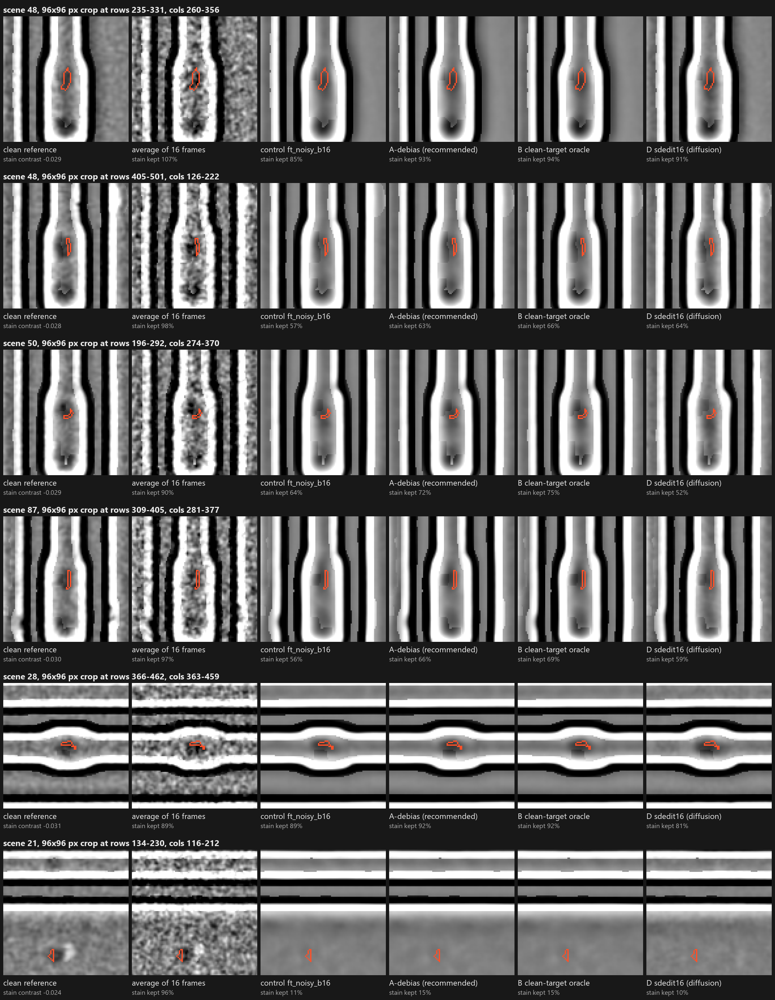

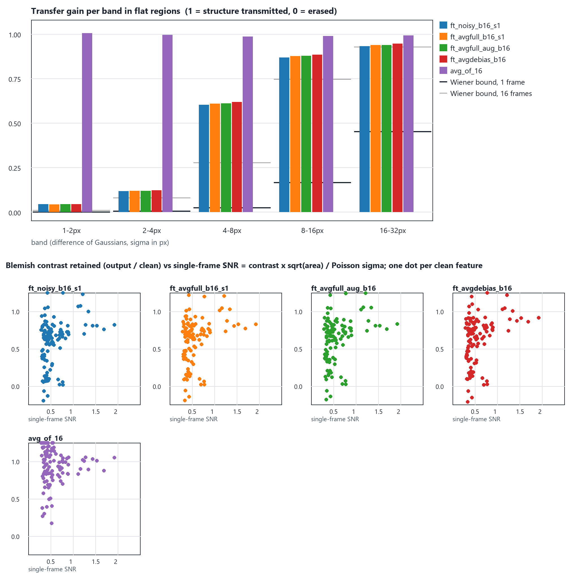

| method | PSNR dB | pixel σ ×10⁻³ | CD 3σ scene | CD 3σ site | CD bias | \|bias\| | center σ | shift σ | retention median | SNR ≥ 1 |
|---|---|---|---|---|---|---|---|---|---|---|
| ft_noisy_b16 (control) | 35.62 | 6.10 | 0.477 | 0.881 | +0.105 | 0.290 | 0.178 | 0.145 | 0.669 | 0.83 |
| ft_avgfull_b16 (A) | 35.79 | 5.82 | 0.452 | 0.790 | +0.081 | 0.277 | 0.168 | 0.136 | 0.673 | 0.86 |
| **ft_avgdebias_b16** | **36.15** | 6.07 | 0.461 | 0.749 | **+0.024** | **0.241** | 0.162 | 0.136 | **0.702** | **0.91** |
| ft_cleanfull_b16 (oracle) | 36.24 | 6.02 | 0.463 | 0.734 | +0.013 | 0.234 | 0.161 | 0.138 | 0.718 | 0.91 |

Paired vs the control (n = 10): PSNR **+0.53 dB** (9/10, p = .004; vs the
control's other seeds +0.56 / +0.51, p ≤ .007); CD 3σ **−0.12 px** (9/10,
sign p = .02, t p = .19); |bias| −0.088 px (8/10, p = .14); signed bias
−0.118 px (7/10, p = .07); pixel σ unchanged (6/10, p = .72). Fine features:
band gain 0.618 at 4–8 px (the oracle's exact value), retention median 0.702
and 0.914 at SNR ≥ 1 (oracle 0.718 / 0.911), retake std 0.090, false
features 0.02.

The debiased burst mean reproduces the clean-target oracle on every accuracy
column — PSNR within 0.09 dB, signed bias within 0.011 px, |bias| within
0.007 px, retention within 0.016 — **from noisy frames only**. The one column
it does not improve is pixel σ: $g^{-1}$ has slope up to 1.4 at the bright
end, so the debiased target is a little noisier than the plain 15-frame mean
and the 5 % pixel-σ gain of arm A is spent. Both variants are one config
line apart, so the choice is a deployment one: accuracy/bias (`avgdebias`)
or repeatability (`avgfull`, and `avgfull_consist` when precision is the
only thing that matters).

The deployment prerequisite is a calibrated detector response: on real
instruments $g$ is the measured saturation/gain curve of the detector rather
than a Poisson clip, and the leave-one-out mean must be registered before it
is used as a target (drift inside the burst becomes blur otherwise, as the
ladder report already noted for the consistency pair).

## 9. Seed replication

Three seeds of the control and of arm A, evaluated in one table with the
other arms (`repeatability_val_ff_final/`, paired files
`paired_vs_ft_noisy_b16{,_s1,_s2}.md`):

| seed | control: PSNR / pixel σ / CD 3σ / bias | arm A: PSNR / pixel σ / CD 3σ / bias | paired A − control: PSNR (p) · pixel σ scenes (p) · CD Δ px (scenes) |
|---|---|---|---|
| 0 | 35.62 / 6.10 / 0.477 / +0.105 | 35.79 / 5.82 / 0.452 / +0.081 | +0.17 (.0001) · 9/10 (.002) · −0.076 (8/10) |
| 1 | 35.59 / 6.11 / 0.511 / +0.129 | 35.80 / 5.87 / 0.476 / +0.089 | +0.21 (.001) · 9/10 (.003) · −0.194 (8/10) |
| 2 | 35.64 / 6.08 / 0.528 / +0.115 | 35.77 / 5.87 / 0.473 / +0.107 | +0.13 (.003) · 9/10 (.007) · −0.087 (9/10, sign .02) |

The control's scene-median CD spans 0.477–0.528 across seeds (the ~0.06 px
run-to-run spread the D1 study measured); arm A's spans 0.452–0.476 and is
below the control in each pairing and in all nine cross-pairings. PSNR and
pixel σ effects are individually significant in every pairing; the CD effect
is consistent in direction (7–9 of 10 scenes) and its size (−0.04 to −0.19
px) sits inside the single-scene spread, so it is reported as directional.
Bias deltas are small and not significant. Fine-feature retention reproduces:
control seeds 0.662 / 0.642 vs arm A 0.682 / 0.678 (median), 0.819 / 0.803 vs
0.851 / 0.863 at SNR ≥ 1.

## 10. Verdict, recommended pipeline, next steps

**On the question.** The pipeline was not at a physical limit for the
structured fine features, and it is now measurably closer to the oracle on
them; it *is* at the information limit for the pixel grain, and that limit is
now demonstrated from the burst itself rather than asserted. The DDIM
comparison that motivated the question is explained rather than reproduced:
a generative chain adds prior texture, and on a single-frame posterior that
texture is synthetic — the measurements say so directly (added band energy
with unchanged residual–grain correlation, lower feature retention, higher
retake spread).

**Recommended pipeline (deployable, single-frame inference, no clean image):**

1. Phase 1 — Noise2Noise teacher on registered bursts (unchanged).
2. Phase 2 — fine-tune with both fidelity terms on the **leave-one-out burst
   mean pushed through the detector response** (`target: noisy_mean`,
   `target_debias_peak`), Sobel term on ($\lambda_g = 4$), batch 16, 10k
   steps. This is the accuracy/bias estimator: +0.5 dB, bias at the oracle's
   level, best non-oracle feature retention.
3. For a precision-only measurement head, the same phase 2 with
   $\lambda_c = 1$ on the plain burst mean (`ft_avgfull_consist`): CD 3σ
   0.368 px, pixel σ −28 %, at the known PSNR/bias cost. Whether the
   debiased target and the consistency term combine is one untested cell.
4. Optional display channel: the SDEdit output of a prior trained on
   long-dwell references — unbiased and visually textured, with the caveat
   that its grain is drawn, not measured; never the input to a CD algorithm.

**Next steps, in order.**

1. Seed-replicate `ft_avgdebias_b16` and `ft_avgfull_consist` (3 seeds), and
   run the one untested cell (debiased target + $\lambda_c = 1$).
2. One confirmatory run of the frozen recipe on the **locked test split**,
   preceded by generating enough evaluation replicas that `avg_of_8/16`
   carry real σ estimates (backlog B2).
3. Real bursts: registration of the LOO mean and the consistency pair,
   detector response curve for the debias map, and the truth-free CD site
   protocol (backlog B1) — the three things the synthetic corpus hides.
4. Gradient-domain consistency (`‖S f(y₁) − S f(y₂)‖²`), still unrun.
5. If the display channel matters: a larger prior (more scenes, 128-px
   crops) and the Anscombe-space chain; the exact-likelihood sampler needs a
   better prior before it is worth revisiting.

## 11. Reproduce

Configs `edge_denoise/configs/miic_p10_dedup_ft_{avgfull_b16, cleanfull_b16,
avgfull_consist, avgfull_aug_b16, avgdebias_b16}.yml` and
`miic_p10_dedup_prior.yml`; seed variants are the same files with
`training.seed` / `run_dir` changed. Diagnostic:
`python -m edge_denoise fine-features --config <cfg> --checkpoint NAME=PATH …
[--burst-checkpoint n2n=…] [--prior-checkpoint … --posterior-arm NAME=sdedit,steps=25,eta=1,variance=0.16] --out <dir>`;
metrology: `python -m edge_denoise repeatability …` with the same arm
options, then `python -m burst_diffusion paired --results … --control
ft_noisy_b16`. Figures: `docs/images/ff_*.png` (band-gain/retention charts
per study phase, feature plates, prior samples). Tests:
`python -m pytest tests/edge_denoise` (fine-feature diagnostic, prior and
posterior samplers, burst-mean and debiased targets, defect augmentation).

Caveats carried over: 10 dev scenes, 64-px synthetic Poisson patches, one
seed for arms B/C/E/A-debias and the prior, CD sites selected on the clean
image; the locked test split was not touched.
